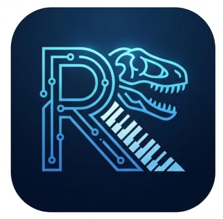

# Rexiano

[](https://github.com/nickhsu-endea/Rexiano/actions/workflows/ci.yml)
[](https://codecov.io/gh/nickhsu-endea/Rexiano)

A free, open-source piano practice app with falling notes, MIDI keyboard support, and practice tools -- built by a dad for his son, shared with everyone.

[繁體中文](README-zh.md) | **English**

<!-- TODO: Add screenshot or GIF of the app in action -->
<!--  -->

---

## Features

**Visual Learning**

- Falling notes display (rhythm game style) rendered at 60 FPS via WebGL
- 88-key piano keyboard with real-time highlighting
- Per-track note coloring for left/right hand distinction

**Audio**

- SoundFont-based piano playback (Web Audio API)
- Volume control with master slider
- Synthesizer fallback when SoundFont is unavailable

**MIDI Connectivity**

- USB and Bluetooth MIDI keyboard input/output
- Hot-plug detection (connect/disconnect devices while running)
- Auto-reconnect to last used device
- Sustain pedal (CC64) support

**Practice Mode**

- **Watch Mode** -- sit back and observe the playback
- **Wait Mode** -- playback pauses until you play the correct notes
- **Free Mode** -- play along at your own pace
- Adjustable speed (0.25x to 2.0x)
- A-B loop for practicing difficult passages
- Split-hand practice (select which tracks to practice)
- Real-time scoring with accuracy and streak tracking

**Themes**

- Four built-in themes: Lavender, Ocean, Peach, and Midnight (dark)
- All colors driven by CSS custom properties for full consistency

**File Handling**

- Import any `.mid` / `.midi` file
- Drag-and-drop support
- Built-in song library with difficulty ratings

---

## Installation

Download the latest release for your platform from the [Releases](https://github.com/nickhsu-endea/Rexiano/releases) page.

### Windows

1. Download `Rexiano-x.x.x-setup.exe`
2. Run the installer and follow the prompts
3. Launch Rexiano from the desktop shortcut or Start Menu

> **Windows SmartScreen warning**: Because the app is not code-signed, Windows may show a "Windows protected your PC" dialog. Click **More info**, then **Run anyway**. This is safe -- the app is open source and you can audit every line of code in this repository.

### macOS

1. Download `Rexiano-x.x.x-arm64.dmg` (Apple Silicon) or `Rexiano-x.x.x-x64.dmg` (Intel)
2. Open the DMG and drag Rexiano to your Applications folder
3. On first launch, right-click the app and select **Open** (or go to System Settings > Privacy & Security > Open Anyway)

> **Gatekeeper notice**: Since the app is not notarized with Apple, macOS will block it on first launch. The right-click > Open workaround is only needed once.

### Linux

**AppImage** (recommended -- no installation required):

1. Download `Rexiano-x.x.x-x86_64.AppImage`
2. Make it executable: `chmod +x Rexiano-*.AppImage`
3. Run it: `./Rexiano-*.AppImage`

**Debian / Ubuntu**:

1. Download `Rexiano-x.x.x-amd64.deb`
2. Install: `sudo dpkg -i Rexiano-*.deb`

---

## Bluetooth MIDI Setup

Rexiano supports Bluetooth MIDI keyboards directly on Windows, macOS, and Linux — no bridge software required:

1. Enable Bluetooth on your keyboard
2. Pair your keyboard in your OS Bluetooth settings
3. Open Rexiano and select your keyboard in the device selector

For detailed instructions, see the **[Installation Guide — Bluetooth MIDI](docs/installation-en.md)**.

---

## Development

### Prerequisites

- [Node.js](https://nodejs.org/) 20 or later
- [pnpm](https://pnpm.io/) 9 or later
- Git

### Quick Start

```bash
# Clone the repository
git clone https://github.com/nickhsu-endea/Rexiano.git
cd Rexiano

# Install dependencies
pnpm install

# Start the dev server with hot reload
pnpm dev

# Run in sandbox mode (if not using WSL2)
pnpm dev:sandbox
```

### Scripts

| Command                | Description                                        |
| ---------------------- | -------------------------------------------------- |
| `pnpm dev`             | Start Electron in development mode with HMR        |
| `pnpm build`           | Typecheck + production build                       |
| `pnpm build:win`       | Build Windows installer (.exe)                     |
| `pnpm build:mac`       | Build macOS disk image (.dmg)                      |
| `pnpm build:linux`     | Build Linux packages (.AppImage, .deb)             |
| `pnpm test`            | Run all tests with Vitest                          |
| `pnpm test:coverage`   | Run tests with code coverage report                |
| `pnpm test:watch`      | Run tests in watch mode                            |
| `pnpm test:e2e`        | Build app and run Playwright Electron E2E tests    |
| `pnpm test:e2e:update` | Build app and update Playwright visual snapshots   |
| `pnpm test:visual`     | Build app and run visual regression snapshot tests |
| `pnpm lint`            | Run ESLint                                         |
| `pnpm typecheck`       | Run TypeScript compiler checks                     |
| `pnpm format`          | Format code with Prettier                          |

### Project Structure

```
src/
  main/                  # Electron main process
    ipc/                 # IPC handlers (file dialog, MIDI permissions)
  preload/               # Context bridge (secure IPC)
  renderer/src/
    engines/             # Pure logic (no React dependency)
      audio/             # Web Audio API + SoundFont
      fallingNotes/      # PixiJS rendering + ticker loop
      midi/              # MIDI device management + parsing
      practice/          # Wait mode, scoring, speed, loops
    stores/              # Zustand state management
    features/            # React UI components
    themes/              # Theme tokens (CSS custom properties)
resources/               # SoundFont files, bundled MIDI songs
build/                   # Electron-builder resources (icons, entitlements)
```

---

## Tech Stack

| Layer     | Technology                                    | Purpose                                       |
| --------- | --------------------------------------------- | --------------------------------------------- |
| Desktop   | Electron 33                                   | Cross-platform shell, system APIs, packaging  |
| Build     | electron-vite 5 + Vite 7                      | Fast HMR, module bundling                     |
| UI        | React 19 + TypeScript 5.9                     | Component-based interface                     |
| Styling   | Tailwind CSS 4 + CSS Custom Properties        | Theme system                                  |
| State     | Zustand 5                                     | Lightweight global state (6 stores)           |
| Rendering | PixiJS 8                                      | WebGL canvas for falling notes at 60 FPS      |
| MIDI      | @tonejs/midi + Web MIDI API                   | File parsing + live device I/O                |
| Audio     | Web Audio API + SoundFont (soundfont2)        | Piano playback                                |
| Fonts     | @fontsource (Nunito, DM Sans, JetBrains Mono) | Offline, no CDN                               |
| Testing   | Vitest 4 + Playwright 1.58                    | Unit tests + Electron E2E + visual regression |
| Packaging | electron-builder 26                           | Installers for Win / Mac / Linux              |

---

## Documentation

| Document               | English                                            | 繁體中文                                           |
| ---------------------- | -------------------------------------------------- | -------------------------------------------------- |
| **README**             | You are here                                       | [README-zh.md](README-zh.md)                       |
| **User Guide**         | [docs/user-guide-en.md](docs/user-guide-en.md)     | [docs/user-guide.md](docs/user-guide.md)           |
| **Installation Guide** | [docs/installation-en.md](docs/installation-en.md) | [docs/installation.md](docs/installation.md)       |
| **Architecture**       | [docs/architecture.md](docs/architecture.md)       | [docs/architecture-zh.md](docs/architecture-zh.md) |
| **System Design**      | [docs/DESIGN-en.md](docs/DESIGN-en.md)             | [docs/DESIGN.md](docs/DESIGN.md)                   |
| **Roadmap**            | [docs/ROADMAP.md](docs/ROADMAP.md)                 | [docs/ROADMAP.md](docs/ROADMAP.md)                 |

---

## License

Rexiano is licensed under the [GNU General Public License v3.0](LICENSE).

You are free to use, modify, and distribute this software under the terms of the GPL-3.0 license. If you distribute modified versions, you must also make your source code available under the same license.

---

## Contributing

Contributions are welcome! Please read the [Architecture doc](docs/architecture.md) and [System Design doc](docs/DESIGN-en.md) before writing code, and follow the three-layer architecture (engines → stores → features).

```bash
pnpm lint && pnpm typecheck && pnpm test
```

---

## Acknowledgments

- Built with love for Rex, who is learning to play piano
- [Synthesia](https://www.synthesia.app/) for the original inspiration
- The open-source community for the incredible tools that make this project possible
