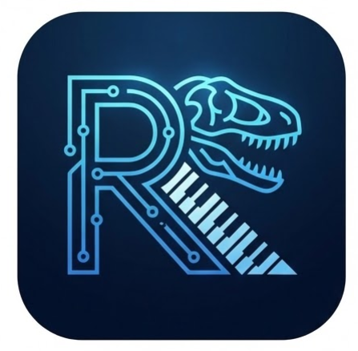

# Rexiano

Free, open-source piano practice for falling notes, sheet music, MIDI keyboards, and focused practice -- built by a dad for Rex and shared with learners.

[繁體中文](README-zh.md) | **English**

> **TL;DR** -- Rexiano runs offline on Windows, macOS, and Linux. Load a built-in or imported MIDI song, then practice with falling notes, sheet music, Watch/Wait/Free modes, loops, scoring, and USB/Bluetooth MIDI keyboard feedback. Current app version: `1.3.0`.

<table>
  <tr>
    <td width="33%" align="center">
      <br>
      <sub>Song Library: built-in songs, filters, favorites, and recent files.</sub>
    </td>
    <td width="33%" align="center">
      <br>
      <sub>Practice View: falling notes, keyboard feedback, scoring, loops, and speed control.</sub>
    </td>
    <td width="33%" align="center">
      <br>
      <sub>Split Sheet: notation and falling notes stay in sync.</sub>
    </td>
  </tr>
</table>

## Start Practicing

1. Download the latest build from [GitHub Releases](https://github.com/EndeavorYen/Rexiano/releases).
2. Open Rexiano and choose a built-in song, or drag in your own `.mid` / `.midi` file.
3. Start with **Watch** mode, then switch to **Wait** mode when you want Rexiano to pause until you play the right notes.
4. Connect a USB or Bluetooth MIDI keyboard when you want live key feedback and scoring.

No keyboard is required for listening and visual study. Wait mode and scored practice need MIDI input.

## Highlights

| Area            | What Rexiano Helps With                                                                                                    |
| --------------- | -------------------------------------------------------------------------------------------------------------------------- |
| Visual learning | 60 FPS falling notes, 88-key highlighting, note labels, and per-track colors for left/right hand separation.               |
| Sheet music     | Split, sheet-only, and falling-notes display modes for switching between notation and piano-roll practice.                 |
| Practice focus  | Watch, Wait, and Free modes, plus speed control, A-B loop, split-hand practice, metronome, count-in, and progress history. |
| MIDI keyboards  | USB and Bluetooth MIDI input/output, hot-plug detection, auto-reconnect, and sustain pedal support.                        |
| Sound           | Bundled FreePats Upright Piano KW SoundFont with Web Audio playback and a synthesizer fallback.                            |
| Files           | Built-in song library plus drag-and-drop import for your own MIDI files.                                                   |

## Install

| Platform | Download                                                                   | Notes                                                                                                                          |
| -------- | -------------------------------------------------------------------------- | ------------------------------------------------------------------------------------------------------------------------------ |
| Windows  | `rexiano-x.x.x-setup.exe`, `rexiano-x.x.x-win-x64.zip`, or portable `.exe` | Use the `.zip` build if your browser blocks direct `.exe` downloads. The installer adds shortcuts; portable builds do not.     |
| macOS    | `rexiano-x.x.x-arm64.dmg` or `rexiano-x.x.x-x64.dmg`                       | Drag Rexiano to Applications. On first launch, use Control-click > Open or System Settings > Privacy & Security > Open Anyway. |
| Linux    | `rexiano-x.x.x-x86_64.AppImage` or `rexiano-x.x.x-amd64.deb`               | AppImage runs without installation; `.deb` integrates with Debian/Ubuntu app menus.                                            |

Public builds are currently unsigned/not notarized, so Windows SmartScreen or macOS Gatekeeper may ask for confirmation on first launch. See the [Installation Guide](docs/installation-en.md) and [release signing notes](docs/release-signing.md) for details.

Each release includes `SHA256SUMS.txt` for checksum verification. Rexiano can also check GitHub Releases from Settings > About.

## Bluetooth MIDI

Bluetooth MIDI support depends on how your operating system exposes the keyboard:

| Platform | Setup                                                                                                                                            |
| -------- | ------------------------------------------------------------------------------------------------------------------------------------------------ |
| macOS    | Pair the keyboard in Bluetooth settings, then select it in Rexiano.                                                                              |
| Linux    | Pair through BlueZ/ALSA, confirm the MIDI port appears, then select it in Rexiano.                                                               |
| Windows  | Try Rexiano's Bluetooth scan first. If the paired keyboard does not appear as MIDI input, use MIDIberry or the KORG BLE-MIDI Driver as a bridge. |

Detailed steps live in [User Guide -- Connecting a MIDI Keyboard](docs/user-guide-en.md#5-connecting-a-midi-keyboard).

## Develop

Prerequisites: [Node.js](https://nodejs.org/) `>=22 <23`, [pnpm](https://pnpm.io/) `>=10 <11`, and Git.

```bash
git clone https://github.com/EndeavorYen/Rexiano.git
cd Rexiano
pnpm install
pnpm dev
```

Common commands:

| Command            | Purpose                                      |
| ------------------ | -------------------------------------------- |
| `pnpm dev`         | Start Electron in development mode with HMR. |
| `pnpm build`       | Typecheck and build the production app.      |
| `pnpm lint`        | Run ESLint.                                  |
| `pnpm typecheck`   | Run TypeScript checks.                       |
| `pnpm test`        | Run Vitest unit tests.                       |
| `pnpm test:e2e`    | Build and run Playwright Electron E2E tests. |
| `pnpm test:visual` | Build and run focused UI visual guard tests. |

Before opening a PR, run:

```bash
pnpm lint && pnpm typecheck && pnpm test
```

To refresh README screenshots:

```bash
pnpm build
pnpm exec playwright test -c scripts/playwright.readme-screenshots.config.ts
```

## Project Map

```text
src/
  main/                  Electron main process and IPC
  preload/               Secure context bridge
  renderer/src/
    engines/             Pure logic: audio, falling notes, MIDI, practice
    stores/              Zustand state
    features/            React UI
    themes/              CSS custom property tokens
resources/               SoundFont files and built-in MIDI songs
build/                   Electron-builder resources
```

## Tech Stack

| Layer     | Technology                                            |
| --------- | ----------------------------------------------------- |
| Desktop   | Electron 39                                           |
| UI        | React 19, TypeScript 5.9, Tailwind CSS 4              |
| Rendering | PixiJS 8 for falling notes, VexFlow 5 for sheet music |
| State     | Zustand 5                                             |
| MIDI      | Web MIDI API, `@tonejs/midi`                          |
| Audio     | Web Audio API, `soundfont2`                           |
| Testing   | Vitest 4, Playwright 1.58                             |
| Packaging | electron-builder 26                                   |

## Documentation

| Goal                                 | English                                                                        | 繁體中文                                                             |
| ------------------------------------ | ------------------------------------------------------------------------------ | -------------------------------------------------------------------- |
| Start using Rexiano                  | [User Guide](docs/user-guide-en.md)                                            | [使用手冊](docs/user-guide.md)                                       |
| Install or troubleshoot first launch | [Installation Guide](docs/installation-en.md)                                  | [安裝指南](docs/installation.md)                                     |
| Understand the architecture          | [Architecture](docs/architecture.md), [System Design](docs/DESIGN-en.md)       | [架構文件](docs/architecture-zh.md), [系統設計](docs/DESIGN.md)      |
| Track project work                   | [Roadmap](docs/ROADMAP.md)                                                     | [開發路線圖](docs/ROADMAP.md)                                        |
| Review release policy                | [Release Signing](docs/release-signing.md), [Update Flow](docs/update-flow.md) | [簽章政策](docs/release-signing.md), [更新流程](docs/update-flow.md) |

## Contributing

Contributions are welcome. Please read [CONTRIBUTING.md](CONTRIBUTING.md), the [Architecture doc](docs/architecture.md), and the [System Design doc](docs/DESIGN-en.md) before changing code.

Keep changes small, testable, and aligned with the existing engine/store/feature boundaries.

## License

Rexiano is licensed under the [GNU General Public License v3.0](LICENSE). You may use, modify, and distribute it under GPL-3.0 terms; distributed modifications must make source code available under the same license.

## Acknowledgments

- Built with love for Rex, who is learning to play piano.
- Thank you to the open-source projects that make Rexiano possible.
