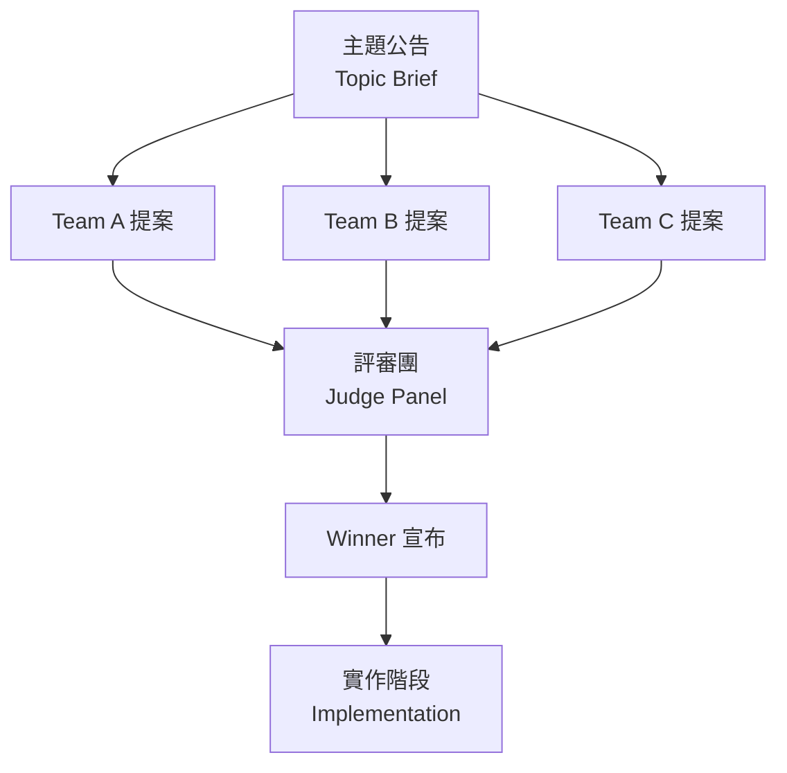
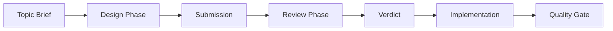
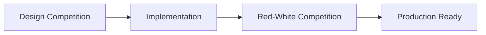

# Design Competition — Game Rules

> 多團隊提案競賽。針對一個主題，多個團隊各自提出設計方案，由獨立評審團挑出最佳方案作為實作藍圖。

---

## 1. Concept



- **多個設計團隊** — 各自獨立提案，互不可見
- **評審團** — 根據評分標準打分，選出最佳方案
- **勝出方案** — 作為實作藍圖，進入開發階段

---

## 2. Participants & Permissions

| Role | Can Read Code | Can Edit Code | Can See Other Proposals | Purpose |
|------|:---:|:---:|:---:|---------|
| **Design Team (×N)** | Yes | **No** | **No** | 提出完整設計方案 |
| **Judge Panel** | Yes | **No** | **Yes (all proposals)** | 評分 + 選出最佳方案 |
| **Implementation Team** | Yes | **Yes** | Winner only | 實作勝出方案 |

### Information Isolation

- 每個 Design Team 是獨立 Agent，看不到其他團隊的提案
- 所有團隊收到**相同的 Topic Brief**
- 評審團收到**所有提案**但不知道是哪個團隊提出的（盲審）

---

## 3. Competition Flow



### Phase A: Topic Brief（主題公告）

Orchestrator 發布主題說明，包含：

```markdown
## Topic Brief

**主題名稱:** {TOPIC_NAME}
**背景:** {為什麼需要這個功能/改進}
**目標使用者:** {誰會用到}
**範圍約束:** {in-scope / out-of-scope}
**技術限制:** {必須遵守的技術約束，例如現有架構、套件版本}
**參考資料:** {相關的 DESIGN.md section、現有程式碼路徑}

### 需回答的設計問題
1. {核心問題 1}
2. {核心問題 2}
3. ...
```

### Phase B: Design Phase（設計階段）

每個團隊獨立完成設計提案。團隊可以：
- 讀取現有程式碼（了解架構慣例）
- 使用 Playwright 觀察現有 App 行為
- 搜尋相關技術文件

團隊**不可以**：
- 修改任何檔案
- 看到其他團隊的提案

### Phase C: Review Phase（評審階段）

評審團收到所有提案（匿名），逐項評分後選出勝出方案。

### Phase D: Implementation（實作階段）

勝出方案交給 Implementation Team 執行，遵循正常開發流程。

---

## 4. Proposal Format（提案格式）

每個團隊必須按此格式提交：

```markdown
# Proposal: {方案名稱}

## 1. Executive Summary（摘要）
{2-3 句描述核心設計理念}

## 2. Architecture Design（架構設計）

### 2.1 High-Level Architecture
{使用 Mermaid 圖 — 系統組件、資料流、模組關係}

### 2.2 File Structure
{列出要新增/修改的檔案，說明每個檔案的職責}

### 2.3 Data Model
{核心資料結構定義，TypeScript interface / type}

### 2.4 Key Algorithms / Logic
{描述核心邏輯，例如排序規則、狀態機、計算公式}

## 3. UI/UX Design（介面設計）
{畫面描述或 ASCII wireframe，使用者操作流程}

## 4. Pros & Cons Analysis（優缺點分析）

### Pros（優點）
- {優點 1 — 為什麼這個設計好}
- {優點 2}
- ...

### Cons（缺點）
- {缺點 1 — 承認不足之處}
- {缺點 2}
- ...

### Trade-offs（取捨說明）
{解釋為什麼在多個可行方案中選擇了這個}

## 5. Implementation Plan（實作規劃）

### 5.1 Delivery Slices（交付切片）
{將實作拆成 3~5 個可獨立交付的切片，每個切片有明確的完成定義}

| Slice | 內容 | 涉及檔案 | 預估複雜度 |
|-------|------|---------|-----------|
| 1     |      |         | Low/Med/High |
| 2     |      |         |           |
| ...   |      |         |           |

### 5.2 Testing Strategy（測試策略）
{每個切片要寫哪些測試，覆蓋什麼場景}

### 5.3 Migration / Compatibility（遷移/相容性）
{對現有功能的影響，需要的遷移步驟}

## 6. Risk Assessment（風險評估）
| 風險 | 機率 | 影響 | 緩解方案 |
|------|------|------|---------|
|      | 高/中/低 | 高/中/低 |    |

## 7. Open Questions（待確認問題）
{列出需要使用者/PM 確認的決策點}
```

---

## 5. Judging Criteria（評分標準）

評審團根據以下維度打分（每項 1-10 分）：

| 維度 | 權重 | 評分重點 |
|------|:---:|---------|
| **Architecture Fit（架構契合度）** | 25% | 是否符合現有架構慣例？是否與 DESIGN.md 一致？ |
| **Correctness（正確性）** | 20% | 設計邏輯是否正確？有無遺漏的 edge case？ |
| **Simplicity（簡潔性）** | 20% | 最小必要複雜度？是否 over-engineered？ |
| **User Impact（使用者影響）** | 15% | 對使用者體驗的改善程度？ |
| **Implementability（可實作性）** | 10% | 切片是否合理？能否漸進交付？ |
| **Risk Awareness（風險意識）** | 10% | 優缺點分析是否誠實？風險緩解是否務實？ |

### Scoring Formula

```
Total = Σ (score × weight)
Max = 10.0
```

---

## 6. Judge Verdict Format（評審結果格式）

```markdown
=== DESIGN COMPETITION VERDICT ===
Topic: {TOPIC_NAME}
Teams: {N} proposals received

## Scoring Matrix

| Criteria (weight)           | Team A | Team B | Team C |
|-----------------------------|:------:|:------:|:------:|
| Architecture Fit (25%)      |  /10   |  /10   |  /10   |
| Correctness (20%)           |  /10   |  /10   |  /10   |
| Simplicity (20%)            |  /10   |  /10   |  /10   |
| User Impact (15%)           |  /10   |  /10   |  /10   |
| Implementability (10%)      |  /10   |  /10   |  /10   |
| Risk Awareness (10%)        |  /10   |  /10   |  /10   |
| **Weighted Total**          | **/10**| **/10**| **/10**|

## Per-Team Commentary

### Team A: {方案名稱}
- Strengths: ...
- Weaknesses: ...

### Team B: {方案名稱}
- Strengths: ...
- Weaknesses: ...

### Team C: {方案名稱}
- Strengths: ...
- Weaknesses: ...

## Verdict

**Winner: Team {X} — "{方案名稱}"**

Reason: {2-3 句說明為什麼這個方案最好}

## Recommendations for Implementation
- {從其他方案借鑑的好想法}
- {勝出方案需補強之處}
- {實作時需注意的風險}
```

---

## 7. Agent Prompt Templates

### 7.1 Design Team Prompt

```
You are DESIGN TEAM {TEAM_ID} — a software architect competing to produce
the best design proposal for {APP_NAME}.

TOPIC BRIEF:
{TOPIC_BRIEF}

PROJECT CONTEXT:
- Read CLAUDE.md for architecture conventions
- Read DESIGN.md for existing system design
- Use Playwright to observe the current app behavior at {DEV_URL}
- Read relevant source code to understand existing patterns

YOUR MISSION:
Produce a complete design proposal following the required format (see below).
Your proposal will be judged blindly against other teams' proposals.

RULES:
1. You may ONLY read code and use Playwright — do NOT edit any files
2. Your proposal must follow existing architecture conventions
3. Be honest about trade-offs — judges value self-awareness over overselling
4. Use Mermaid diagrams for architecture visualization
5. Include concrete TypeScript interfaces for data models

PROPOSAL FORMAT:
{paste §4 Proposal Format}

Think deeply. Be creative. Win.
```

### 7.2 Judge Panel Prompt

```
You are the JUDGE PANEL — an independent design review board for {APP_NAME}.

TOPIC BRIEF:
{TOPIC_BRIEF}

You have received {N} anonymous proposals. Evaluate each one fairly.

PROPOSALS:
--- Proposal A ---
{PROPOSAL_A}
--- Proposal B ---
{PROPOSAL_B}
--- Proposal C ---
{PROPOSAL_C}

SCORING CRITERIA (see detailed rubric):
1. Architecture Fit (25%) — matches existing patterns in DESIGN.md / CLAUDE.md
2. Correctness (20%) — logic soundness, edge case coverage
3. Simplicity (20%) — minimal necessary complexity
4. User Impact (15%) — UX improvement quality
5. Implementability (10%) — realistic delivery slices
6. Risk Awareness (10%) — honest pros/cons, practical mitigation

RULES:
1. You may NOT edit files
2. Read DESIGN.md and CLAUDE.md to verify architecture claims
3. Read relevant source code to validate feasibility
4. Use Playwright to understand current app state
5. Score each dimension 1-10 with brief justification
6. Pick a winner and explain why
7. Recommend any good ideas from losing proposals that should be incorporated

OUTPUT FORMAT:
{paste §6 Judge Verdict Format}
```

### 7.3 Implementation Team Prompt

```
You are the IMPLEMENTATION TEAM for {APP_NAME}.

The following design proposal won the design competition and is your blueprint:

WINNING PROPOSAL:
{WINNING_PROPOSAL}

JUDGE RECOMMENDATIONS:
{JUDGE_RECOMMENDATIONS}

YOUR MISSION:
Implement the winning proposal following its delivery slices.
Incorporate any judge recommendations where applicable.

RULES:
1. Follow the proposal's file structure and data models
2. Follow existing code patterns (see CLAUDE.md)
3. Implement one slice at a time, verify each with quality gate
4. Run `pnpm lint && pnpm typecheck && pnpm test` after each slice
5. Use Playwright to verify UI/UX matches the proposal's design
6. Commit after each slice with descriptive message
```

---

## 8. Deliverables Structure

```
docs/design-competition/{competition-name}/
  topic-brief.md
  proposal-team-a.md
  proposal-team-b.md
  proposal-team-c.md
  judge-verdict.md
  implementation/
    slice-1.md   (progress notes, optional)
    slice-2.md
    ...
```

---

## 9. How to Start a New Competition

1. **Write Topic Brief** — define the problem, scope, constraints (§3 Phase A)
2. **Decide team count** — 2~4 teams recommended (more teams = more diversity but more review work)
3. **Create deliverables directory** — `mkdir -p docs/design-competition/{name}/`
4. **Launch Design Teams in parallel** — each as an independent Agent
5. **Collect proposals** — save to deliverables directory
6. **Launch Judge** — provide all proposals anonymously
7. **Announce winner** — save verdict
8. **Implement** — follow winning proposal's delivery slices

### Quick Start

```bash
# Define your competition
COMP_NAME="my-feature"
TEAMS=3

# Create directory
mkdir -p docs/design-competition/$COMP_NAME

# Write topic-brief.md, then launch agents
```

---

## 10. Variations（變體規則）

### 10.1 Design + Red-White Combo

先用 Design Competition 決定方案，實作完成後用 [Red-White Competition](RED-WHITE-RULES.md) 攻防測試品質。



### 10.2 Rebuttal Round（反駁回合）

在評審前加一輪：每個團隊可以看到其他團隊的提案摘要（不含完整設計），並提交反駁意見。評審團將反駁納入考量。

### 10.3 Hybrid Proposal（混合方案）

評審團不選擇單一贏家，而是從多個提案中取長補短，組合出最終方案。適用於每個提案都有獨特優勢的情況。

---

## 11. Lessons Learned

> Update this section after each competition.

_(No competitions run yet — add learnings here after the first one.)_
