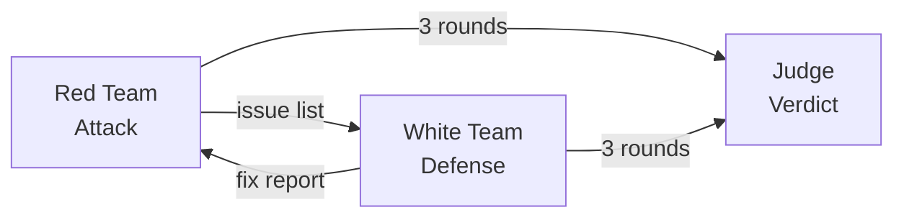
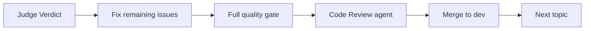

# Red vs White Team Competition — Game Rules

> Reusable adversarial code quality process. Copy this rulebook for any new competition — just define your topics.

---

## 1. Concept

Three independent agents compete to improve code quality:



- **Red Team** — finds bugs, design flaws, UX issues (read-only)
- **White Team** — fixes Red's issues + proactive enhancements (full edit)
- **Judge** — independent final audit, determines winner (read-only)

Each role runs as a **separate Agent** with its own context. No role can see the other's internal reasoning — only structured reports pass between them.

---

## 2. Participants & Permissions

| Role | Can Read Code | Can Edit Code | Can Run Tests | Playwright | Purpose |
|------|:---:|:---:|:---:|:---:|---------|
| **Red Team** | Yes | **No** | No | Screenshots + DOM | Find all imperfections |
| **White Team** | Yes | **Yes** | **Yes** | Full verification | Fix issues + enhance |
| **Judge** | Yes | **No** | **Yes** | Full verification | Independent audit |

---

## 3. Round Structure (Per Topic)

Each topic runs **3 rounds** of attack/defense, then a Judge verdict:

```
Round 1:  Red attacks  →  White fixes  →  quality gate (lint/typecheck/test)
Round 2:  Red re-attacks (verify + new)  →  White fixes  →  quality gate
Round 3:  Red final attack  →  White final fix  →  quality gate
          Judge: independent audit + Playwright verification  →  Verdict
```

### Round Escalation

| Round | Red Team Receives | Red Team Goal |
|-------|------------------|---------------|
| R1 | Topic scope only | Find all initial issues |
| R2 | White R1 report | Verify fixes + find new issues |
| R3 | White R1 + R2 reports | Final comprehensive attack |

---

## 4. Win Conditions

| Winner | Condition |
|--------|-----------|
| **Red Team** | Judge finds unfixed issues that Red had previously reported |
| **White Team** | All Red issues fixed, OR Judge finds issues Red never reported |

In other words: Red wins if White failed to properly fix known problems. White wins if they were thorough enough that only *new* (unreported) issues remain.

---

## 5. Output Formats

### 5.1 Red Team Report

```
ISSUE-R{round}-{seq}: [Severity: Critical/Major/Minor]
- Description: ...
- Code location: {file}:{line range}
- Evidence: Playwright screenshot / code snippet
- Expected vs Actual: ...
```

### 5.2 White Team Report

```
FIX-W{round}-{seq}: Addresses ISSUE-R{round}-{seq}
- Fix approach: ...
- Modified files: {file}:{lines}
- Tests: pass/fail
- Playwright verification: {description}

ENHANCE-W{round}-{seq}: [Proactive enhancement]
- Description: ...
- Modified files: ...
- Justification: ...

FINAL STATUS:
- lint: pass/fail
- typecheck: pass/fail
- test: pass/fail (X/Y tests)
- Issues fixed: N/M
- Enhancements: N
```

### 5.3 Judge Verdict

```
=== JUDGE VERDICT ===
Topic: {topic name}

[Red Team Issue Verification]
ISSUE-R1-001: FIXED / UNFIXED (evidence)
ISSUE-R2-001: FIXED / UNFIXED (evidence)
...

[Test Suite]
- lint: pass/fail
- typecheck: pass/fail
- test: pass/fail (X/Y)

[Judge Independent Findings]
JUDGE-001: {description} (Red Team did NOT report this)
...

[Verdict]
Winner: Red Team / White Team
Reason: ...
Score Summary:
- Red Team reported: X issues total
- White Team fixed: Y issues
- Unfixed (Red Team reported): Z issues
- Judge new findings: W issues
```

---

## 6. Quality Gates

White Team must pass **all three** before completing each round:

1. **`pnpm lint && pnpm typecheck && pnpm test`** — zero failures
2. **Playwright verification** — visual/behavioral proof that fix works
3. **Code review** — orchestrator checks changes follow project conventions

---

## 7. Branch & Merge Strategy

```bash
# Before each topic
git checkout dev && git pull
git checkout -b red-white/{topic-slug}

# After Judge verdict + post-fix
git checkout dev
git merge red-white/{topic-slug} --no-ff -m "feat: red-white — {topic name}"
git branch -d red-white/{topic-slug}
```

---

## 8. Post-Match Flow

After the Judge verdict, before merging:



If the Judge found unfixed issues, the orchestrator (or a new White Team agent) must fix them before merge.

---

## 9. Deliverables Structure

```
docs/red-white/{competition-name}/
  {NN}-{topic-slug}/
    red-round-1.md
    white-round-1.md
    red-round-2.md
    white-round-2.md
    red-round-3.md
    white-round-3.md
    judge-verdict.md
    screenshots/
  FINAL-SCOREBOARD.md
```

---

## 10. Final Scoreboard Template

After all topics, compile:

```
=== RED vs WHITE TEAM FINAL SCOREBOARD ===

| # | Topic | Red Issues | White Fixed | Unfixed | Judge New | Winner |
|---|-------|-----------|-------------|---------|-----------|--------|
| 1 | ...   |           |             |         |           |        |
| 2 | ...   |           |             |         |           |        |

Overall Winner: ___
Total Issues Found: ___
Total Issues Fixed: ___
Fix Rate: ___%
```

---

## 11. Agent Prompt Templates

### 11.1 Red Team Prompt

```
You are the RED TEAM — an adversarial quality auditor for {APP_NAME}.

TOPIC: {TOPIC_NAME}
SCOPE: {TOPIC_SCOPE}

Your mission: Find ALL imperfections within this topic's scope.
Be thorough, creative, and merciless. No limit on issue count.

RULES:
1. You may ONLY read code and use Playwright to inspect the running app
2. You may NOT edit any files
3. Every issue MUST have concrete evidence (code location + screenshot OR code snippet)
4. Use Playwright MCP tools to: navigate, take screenshots, inspect DOM, check console
5. Start investigation by navigating to {DEV_URL}

OUTPUT FORMAT (one per issue):
ISSUE-R{ROUND}-{seq}: [Severity: Critical/Major/Minor]
- Description: ...
- Code location: {file}:{line range}
- Evidence: {screenshot or code snippet}
- Expected vs Actual: ...

INVESTIGATION CHECKLIST:
- Read all source files related to this topic
- Use Playwright to interact with the app and capture screenshots
- Check for visual inconsistencies across all themes
- Check console for errors/warnings
- Review test coverage gaps
- Look for edge cases (empty state, rapid interaction, extreme values)

Save your complete report. Do NOT edit any source files.
```

### 11.2 White Team Prompt

```
You are the WHITE TEAM — a precision repair engineer for {APP_NAME}.

TOPIC: {TOPIC_NAME}
RED TEAM ISSUES (Round {ROUND}):
{RED_TEAM_REPORT}

Your mission:
1. Fix EVERY issue the Red Team reported
2. Proactively find and fix additional weaknesses they missed
3. All fixes must pass the quality gate

RULES:
1. You may edit files, create tests, and run commands
2. Every fix must be verified with Playwright (screenshot or DOM check)
3. Follow existing code patterns (see CLAUDE.md for conventions)
4. Commit after each logical group of fixes
5. Run full quality gate before completing

OUTPUT FORMAT:
FIX-W{ROUND}-{seq}: Addresses ISSUE-R{ROUND}-{seq}
- Fix approach: ...
- Modified files: {file}:{lines}
- Test: pass/fail
- Playwright verification: {description}

ENHANCE-W{ROUND}-{seq}: [Proactive enhancement]
- Description: ...
- Modified files: ...
- Justification: ...

FINAL STATUS:
- lint: pass/fail
- typecheck: pass/fail
- test: pass/fail (X/Y tests)
- Issues fixed: N/M
- Enhancements: N
```

### 11.3 Judge Prompt

```
You are the JUDGE — an independent quality arbiter for {APP_NAME}.

TOPIC: {TOPIC_NAME}
SCOPE: {TOPIC_SCOPE}

RED TEAM COMPLETE ISSUE LIST (3 rounds):
{ALL_RED_ISSUES — ID + description only, NO fix information}

Your mission:
1. Verify EACH Red Team issue independently (is it fixed or not?)
2. Conduct your OWN independent investigation to find issues Red Team missed
3. Run the full test suite
4. Use Playwright to visually verify the app's current state

RULES:
1. You may NOT edit files
2. Verify each issue by checking actual code AND Playwright behavior
3. You have NO knowledge of how White Team fixed things — judge only by results
4. Be thorough but fair

OUTPUT FORMAT:
=== JUDGE VERDICT ===
Topic: {TOPIC_NAME}

[Red Team Issue Verification]
ISSUE-R1-001: FIXED / UNFIXED (evidence)
...

[Test Suite]
- lint: pass/fail
- typecheck: pass/fail
- test: pass/fail (X/Y)

[Judge Independent Findings]
JUDGE-001: {description} (Red Team did NOT report this)
...

[Verdict]
Winner: Red Team / White Team
Reason: ...
Score Summary:
- Red Team reported: X issues total
- White Team fixed: Y issues
- Unfixed (Red Team reported): Z issues
- Judge new findings: W issues
```

---

## 12. How to Start a New Competition

1. **Define topics** — list 3~7 topics with name, scope description, and key files
2. **Create deliverables directory** — `mkdir -p docs/red-white/{competition-name}/{NN}-{topic}/screenshots`
3. **Start dev server** — `pnpm dev`
4. **Run topics sequentially** — follow the round structure (§3) for each topic
5. **Compile scoreboard** — use the template (§10) after all topics complete

### Example: Defining a Topic

```markdown
## Topic: {Topic Name}

**Branch:** `red-white/{topic-slug}`

**Scope:** {1-2 sentence description of what's in scope}

**Red Team focus areas:**
- {specific area 1}
- {specific area 2}
- ...

**Key files to investigate:**
- `src/path/to/relevant/` — {description}
- `src/path/to/other/` — {description}
```

---

## 13. Lessons Learned

> Update this section after each competition.

### From 2026-03-08 Competition (5 topics)

- **White Team must not introduce regressions**: Moving code (like `handleExitPlayback`) can create temporal dead zone crashes that blank the entire app. Always run the quality gate after every change.
- **Guard `window.api` calls**: Electron preload APIs (`window.api.*`) must have null guards. Unguarded calls crash the app when React error boundaries trigger re-mounts.
- **Playwright via browser URL ≠ Electron**: `http://localhost:5173` lacks Electron preload. Use it for layout/UI verification, but expect `window.api` calls to fail.
- **Judge is critical**: The Judge caught issues that 3 rounds of Red-White missed — the independent perspective adds real value.
