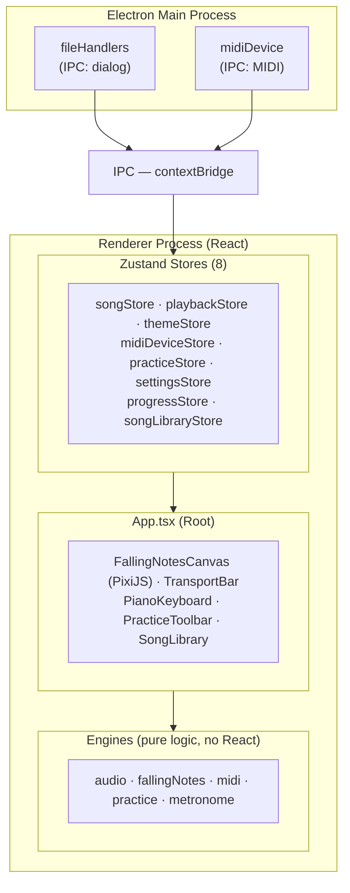
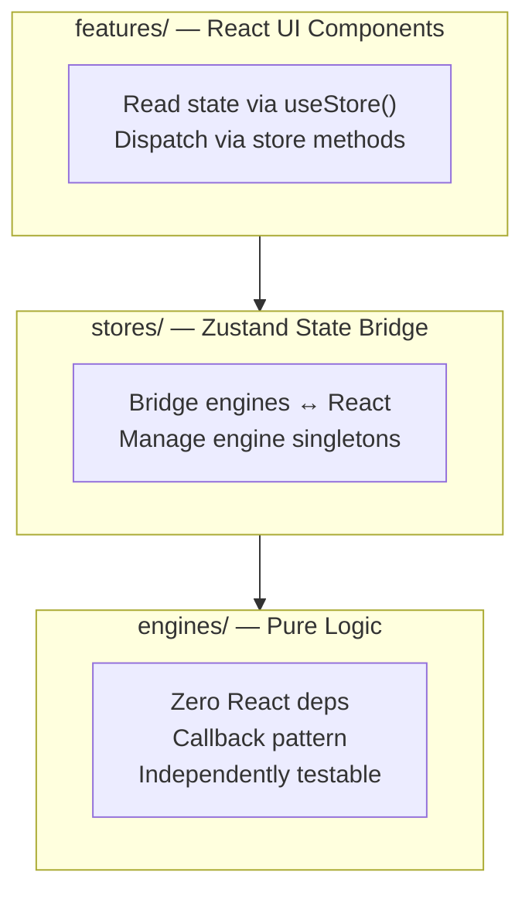
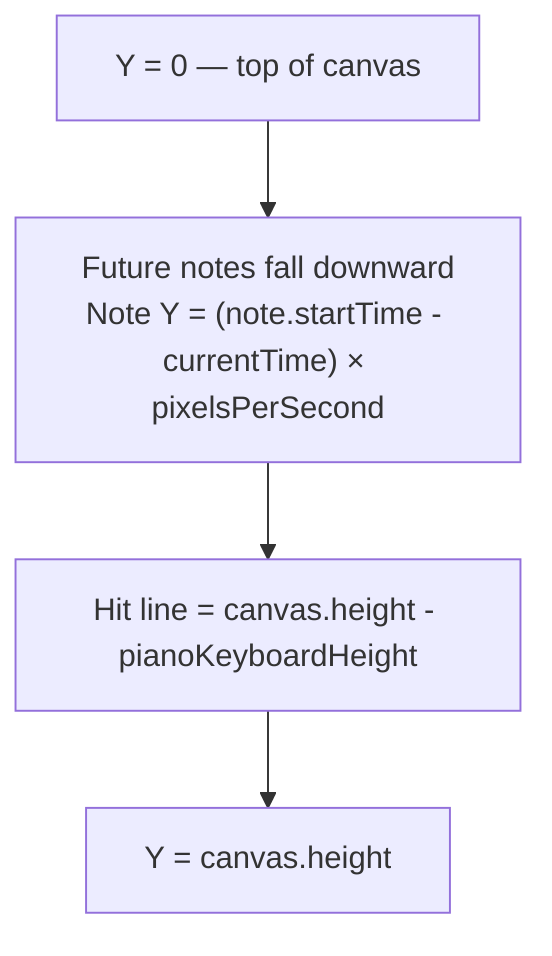
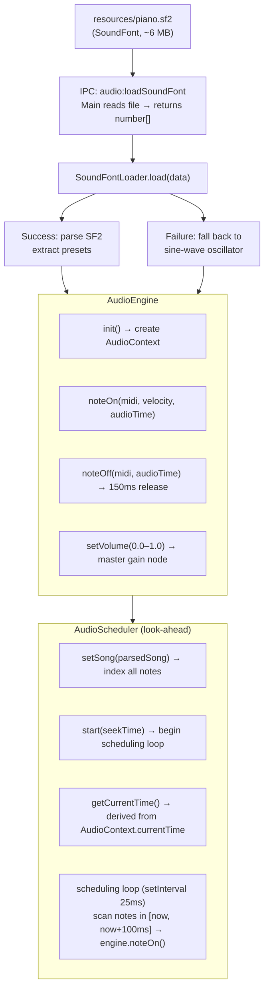
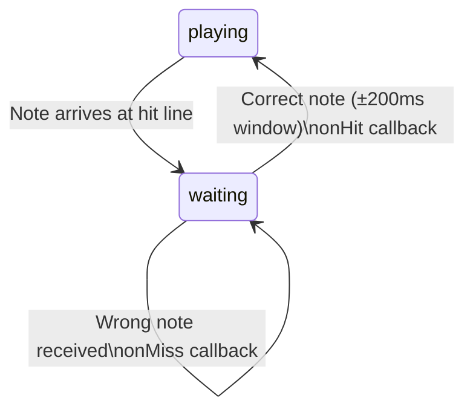

# Rexiano — System Design Document

> **Version**: 1.1
> **Date**: 2026-02-27
> **Status**: Draft (Phase 6.5 added)
>
> Other languages: [繁體中文](./DESIGN.md)

---

## Table of Contents

1. [Project Vision](#1-project-vision)
2. [Architecture Overview](#2-architecture-overview)
3. [Phase 1 — Project Scaffold & MIDI Parsing ✅](#3-phase-1--project-scaffold--midi-parsing)
4. [Phase 2 — Falling Notes Engine ✅](#4-phase-2--falling-notes-engine)
5. [Phase 3 — UI Theme System ✅](#5-phase-3--ui-theme-system)
6. [Phase 4 — Audio Playback ✅](#6-phase-4--audio-playback)
7. [Phase 5 — MIDI Device Connection ✅](#7-phase-5--midi-device-connection)
8. [Phase 6 — Practice Mode ✅](#8-phase-6--practice-mode)
9. [Phase 6.5 — Children's Usability Enhancements](#9-phase-65--childrens-usability-enhancements)
10. [Phase 7 — Sheet Music Display](#10-phase-7--sheet-music-display)
11. [Phase 8 — Score Editor (Extra)](#11-phase-8--score-editor-extra)
12. [Phase 9 — Packaging & Distribution](#12-phase-9--packaging--distribution)
13. [Synthesia Feature Comparison](#13-synthesia-feature-comparison)
14. [Cross-Cutting Concerns](#14-cross-cutting-concerns)

---

## 1. Project Vision

Rexiano (Rex + Piano) is an open-source, cross-platform piano practice application aiming to be a free alternative to Synthesia. The project was born for my son Rex, and is open-sourced for all piano learners.

### Six Core Features

| # | Feature | Description |
|---|---------|-------------|
| 1 | MIDI Import | Load `.mid` files and parse into structured data |
| 2 | Visual Display | Falling notes (rhythm game style) + piano keyboard + sheet music |
| 3 | MIDI Device Connection | Bluetooth / USB MIDI keyboards (e.g., Roland) for input and output |
| 4 | Cross-Platform | Native installers for Windows / macOS / Linux |
| 5 | Score Editor | (Extra) Import, create, and edit MIDI / MusicXML |
| 6 | Practice Mode | Speed control, loop sections, split-hand practice, scoring feedback |

### Why Electron + React?

Electron + React was chosen over Python (PyQt/Pygame) for these reasons:

- **Web MIDI API**: Chromium has full Web MIDI support — Bluetooth MIDI devices only need OS-level pairing
- **PixiJS (WebGL)**: Renders thousands of sprites at 60 FPS; DOM rendering starts dropping frames above ~200 elements
- **Sheet music libraries**: VexFlow / OSMD render interactive sheet music directly in JavaScript — Python lacks equivalent tools
- **Packaging**: Electron produces one-click installers that are more accessible to non-technical users than PyInstaller

---

## 2. Architecture Overview

### Tech Stack

| Layer | Technology | Purpose |
|-------|-----------|---------|
| Desktop shell | Electron 33 | Cross-platform window, system APIs, packaging |
| Build tooling | electron-vite 5 + Vite 7 | Fast HMR, module bundling |
| UI framework | React 19 + TypeScript 5.9 | Component-based UI |
| Styling | Tailwind CSS 4 + CSS Custom Properties | Theme system |
| State management | Zustand 5 | Lightweight global state |
| Canvas rendering | PixiJS 8 | WebGL high-performance rendering |
| MIDI parsing | @tonejs/midi | Parse `.mid` files |
| Fonts | @fontsource (Nunito, DM Sans, JetBrains Mono) | Offline fonts, no CDN dependency |
| Testing | Vitest 4 | Unit tests |
| Packaging | electron-builder 26 | Produce installers |

### Process Architecture



### Three-Layer Architecture

The renderer enforces strict separation:



**Rules:**
1. Engines never import React — pure TypeScript classes/functions
2. Stores bridge engines to React via module-level singleton management
3. Features never instantiate engines directly — go through stores
4. PixiJS code uses `store.getState()` — avoids React re-renders in the 60 FPS loop
5. All engine-to-consumer communication uses the callback pattern, not EventEmitter

### IPC Communication

Electron Main ↔ Renderer communication uses `contextBridge`. Binary data (MIDI files, SoundFont) is sent as `number[]` instead of `Uint8Array` because Electron's structured clone algorithm drops the typed array type across the IPC boundary. Conversion happens at the boundary in `src/shared/types.ts`.

---

## 3. Phase 1 — Project Scaffold & MIDI Parsing

**Status**: ✅ Complete | **Included in**: v0.1.0

### Scope

- Electron + React + TypeScript + Tailwind project initialization
- electron-vite build pipeline (dev / build / typecheck)
- IPC file dialog: system-native dialog for selecting `.mid` files
- MIDI parsing: `@tonejs/midi` converts binary MIDI into structured `ParsedSong`
- Filter empty tracks; normalize all time values to seconds

### Data Model

```
ParsedSong
├── fileName: string
├── duration: number          (seconds)
├── noteCount: number
├── tempos: TempoEvent[]      { time, bpm }
├── timeSignatures: TimeSignatureEvent[]  { time, numerator, denominator }
└── tracks: ParsedTrack[]
    ├── name: string
    ├── noteCount: number
    └── notes: ParsedNote[]
        ├── midi: number      (0-127, MIDI note number)
        ├── startTime: number (seconds)
        ├── duration: number  (seconds)
        └── velocity: number  (0-127)
```

---

## 4. Phase 2 — Falling Notes Engine

**Status**: ✅ Complete | **Included in**: v0.1.0

### Core Design

The falling notes engine renders an animated "piano roll" view using PixiJS 8 (WebGL). Key design decisions:

**Object Pool** (`NoteRenderer`): 512 initial sprites, grows by 50% (min 64) when exhausted. Sprites are acquired from the pool when notes enter the viewport and released when they exit, avoiding GC pressure at 60 FPS.

**Viewport Mapping** (`ViewportManager`): Converts between time coordinates (seconds) and screen coordinates (pixels). The `pixelsPerSecond` value (configurable) controls how fast notes fall.

**Binary Search Culling** (`tickerLoop`): At each frame, notes are culled using binary search on the sorted note array. Only notes in `[currentTime, currentTime + visibleDuration]` are rendered, ensuring O(log n) visibility check for songs with thousands of notes.

**88-Key Layout** (`keyPositions`): Maps MIDI note numbers 21–108 to X positions for a standard 88-key piano layout. Black keys are offset within white key slots.

### Coordinate System



---

## 5. Phase 3 — UI Theme System

**Status**: ✅ Complete | **Included in**: v0.1.0

### Theme Architecture

Rexiano supports 4 themes switchable at runtime without re-rendering the React tree:

1. Theme tokens are defined in `themes/tokens.ts` (28 color values per theme: Lavender / Ocean / Peach / Midnight)
2. `useThemeStore.setTheme()` calls `applyThemeToDOM()` which sets `--color-*` CSS Custom Properties on `:root`
3. All components reference colors via `var(--color-bg)`, `var(--color-accent)`, etc.
4. PixiJS colors are converted via `hexToPixi()` and read from theme tokens directly

Adding a new theme requires only adding a new entry to `tokens.ts` — no component changes needed.

---

## 6. Phase 4 — Audio Playback

**Status**: ✅ Complete | **Included in**: v0.2.0

### Audio Pipeline



**Time source**: `AudioContext.currentTime` (hardware clock), not `requestAnimationFrame`. This ensures audio scheduling is immune to frame drops.

**SoundFont**: TimGM6mb SF2 (`resources/piano.sf2`, ~6 MB). Bundled with the app, no internet required.

---

## 7. Phase 5 — MIDI Device Connection

**Status**: ✅ Complete | **Included in**: v0.3.0

### Device Architecture

```
engines/midi/
  MidiDeviceManager.ts  ← Singleton; wraps navigator.requestMIDIAccess()
  MidiInputParser.ts    ← Decodes 3-byte MIDI messages; callback pattern
  MidiOutputSender.ts   ← Sends MIDI to output devices
  BleMidiManager.ts     ← Web Bluetooth API for BLE MIDI
```

**MidiDeviceManager** uses the Singleton pattern because the Web MIDI API's `MIDIAccess` object is globally unique.

**MidiInputParser** uses the callback pattern:
```typescript
parser.onNoteOn((midi, velocity) => store.recordNoteOn(midi, velocity));
parser.onNoteOff((midi) => store.recordNoteOff(midi));
```

**Bluetooth MIDI**: Web Bluetooth API integration via `BleMidiManager`. Rexiano connects directly to BLE MIDI keyboards on Windows, macOS, and Linux — no bridge software required. The OS Bluetooth pairing step is still needed before Rexiano can see the device.

**MIDI Permissions**: Main process auto-grants `midi` permission via `session.setPermissionRequestHandler` so users are never interrupted by browser permission dialogs.

---

## 8. Phase 6 — Practice Mode

**Status**: ✅ Complete | **Included in**: v0.4.0

### Practice Engines

```
engines/practice/
  WaitMode.ts           ← State machine (playing → waiting → idle)
  SpeedController.ts    ← Speed multiplier (0.25x–2.0x)
  LoopController.ts     ← A-B loop logic
  ScoreCalculator.ts    ← Hit/miss/streak/accuracy accumulator
  practiceManager.ts    ← Module-level singleton manager
```

### WaitMode State Machine

WaitMode is the core of the "Wait" practice feature. It intercepts playback at note boundaries:



**Chord collection**: Notes within a ±200ms window are grouped as a chord. All notes in the chord must be pressed before playback resumes.

### Score System

`ScoreCalculator` accumulates:
- `hits`: correctly pressed notes
- `misses`: wrong or missed notes
- `currentStreak`: consecutive hits
- `bestStreak`: session best streak
- `accuracy`: hits / (hits + misses) as a percentage

Scores are persisted to `progress.json` (via IPC) and displayed as badges in the song library (Gold ≥90%, Silver ≥70%, Bronze <70%).

---

## 9. Phase 6.5 — Children's Usability Enhancements

**Status**: 🔲 In Progress | **Target**: v0.4.1

### Design Goals

Phase 6.5 focuses on making Rexiano accessible to children aged 6–10 (Rex's age group). The design principle: a child should be able to use all core features without reading any text.

### Features

| Feature | Description |
|---------|-------------|
| Keyboard shortcuts | Space=play, R=reset, 1/2/3=mode switch, ↑↓=speed, M=mute |
| Note labels | Display note names (C4, F#5) on falling note rectangles |
| Piano key labels | Display key names on white keys with octave numbers on C keys |
| Onboarding guide | 4-step interactive guide for first-time users |
| Song library | Browse 18 built-in songs with difficulty ratings and best-score badges |
| Recent files | Quick access to the 10 most recently opened MIDI files |
| Celebration overlay | Full-screen celebration animation at ≥90% accuracy |
| Metronome | Visual beat pulse + audio click with count-in support |
| MIDI test button | Test keyboard connection without loading a song |
| Latency compensation | 0–100ms slider to compensate for BLE MIDI latency |
| Settings panel | Gear icon overlay with display, audio, and practice defaults |
| 4 themes | Lavender / Ocean / Peach / Midnight |
| Mode selection modal | Synthesia-style modal to select Watch/Wait/Free before playback |

---

## 10. Phase 7 — Sheet Music Display

**Status**: 🔲 Planned | **Target**: v0.5.0

### Overview

Add a scrolling sheet music panel (five-line staff) alongside or in place of the falling notes view, using the **OpenSheetMusicDisplay (OSMD)** library.

### Display Modes

| Mode | Description |
|------|-------------|
| Falling notes only | Current default view |
| Dual view | Sheet music (top 40%) + falling notes (bottom 60%) |
| Sheet music only | Full-height sheet music panel |

### Cursor Sync

A cursor in the sheet music panel tracks the current playback position in real time, synchronized with `AudioScheduler.getCurrentTime()`.

### MusicXML Generation

To render sheet music from MIDI data, Rexiano will convert `ParsedSong` to a minimal MusicXML document using a custom `MidiToMusicXML` converter that handles:
- Time signature and tempo from MIDI meta events
- Note pitch (MIDI number → note name + octave)
- Note duration (seconds → note value using current tempo)
- Multi-voice support (separate staves for each track)

---

## 11. Phase 8 — Score Editor (Extra)

**Status**: 🔲 Planned | **Target**: v1.0.0

A basic sheet music editor allowing users to:
- Import MusicXML and render it as an editable score
- Create new scores from scratch using a note input tool
- Export edited scores as MIDI or MusicXML

This phase is marked "Extra" — it depends on community interest and development resources.

---

## 12. Phase 9 — Packaging & Distribution

**Status**: 🔲 Planned | **Target**: v1.0.0

### Targets

| Platform | Format | Notes |
|----------|--------|-------|
| Windows | `.exe` (NSIS installer) | Requires code signing for SmartScreen |
| macOS | `.dmg` (Universal Binary) | Requires notarization for Gatekeeper |
| Linux | `.AppImage` + `.deb` + `.rpm` | AppImage preferred for portability |

### CI/CD

GitHub Actions pipeline:
1. Push to `main` → lint + typecheck + test
2. Tag `v*.*.*` → build all three platform installers → publish to GitHub Releases

### Auto-Update

electron-updater integration: checks GitHub Releases for newer versions on launch, downloads and installs silently in the background.

---

## 13. Synthesia Feature Comparison

| Feature | Synthesia | Rexiano |
|---------|-----------|---------|
| Falling notes | ✅ | ✅ |
| MIDI import | ✅ | ✅ |
| USB MIDI keyboard | ✅ | ✅ |
| Bluetooth MIDI | ✅ | ✅ |
| Wait mode | ✅ | ✅ |
| Speed control | ✅ | ✅ |
| A-B loop | ✅ | ✅ |
| Split-hand practice | ✅ | ✅ |
| Sheet music view | ✅ | 🔲 Phase 7 |
| Score editor | ✅ | 🔲 Phase 8 Extra |
| Song library | Paid | ✅ Free (18 built-in) |
| Price | $39/year | Free & Open Source |
| Source available | ❌ | ✅ GPL-3.0 |

---

## 14. Cross-Cutting Concerns

### Offline-First

Rexiano is designed to work completely offline:
- Piano SoundFont bundled with the app (`resources/piano.sf2`)
- Fonts bundled via `@fontsource` (no Google Fonts CDN)
- Song library stored in `resources/songs/`
- Progress data stored locally in `userData/progress.json`

### Accessibility

- Note names displayed on keys and falling notes (configurable)
- High-contrast Midnight theme for low-light environments
- Large hit-line tolerance (±50ms for visual, ±200ms for WaitMode chord grouping)
- Speed control allows practicing at 25% speed for beginners

### Performance

- PixiJS sprite pool avoids per-frame allocation
- Binary search culling for O(log n) visible note selection
- AudioScheduler 100ms look-ahead prevents audio dropouts
- Zustand `store.getState()` in PixiJS avoids React re-renders in the render loop

### Testing

42 test files using Vitest 4. Tests are co-located with source files (`*.test.ts`). Run with:

```bash
pnpm lint && pnpm typecheck && pnpm test
```

---

*For implementation details, see [architecture.md](./architecture.md) (engine catalog, store catalog, data flows).*
*For the development task checklist, see [ROADMAP.md](./ROADMAP.md).*
