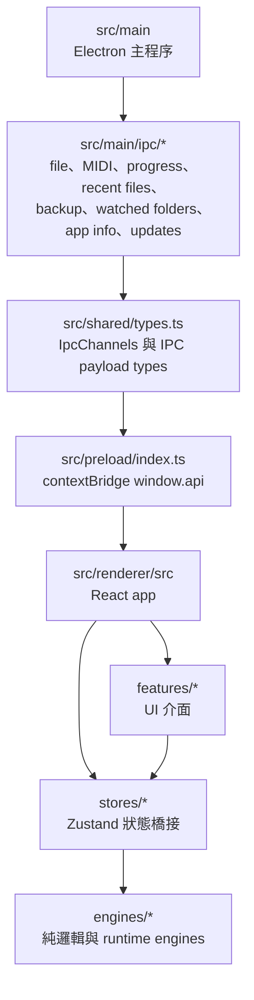
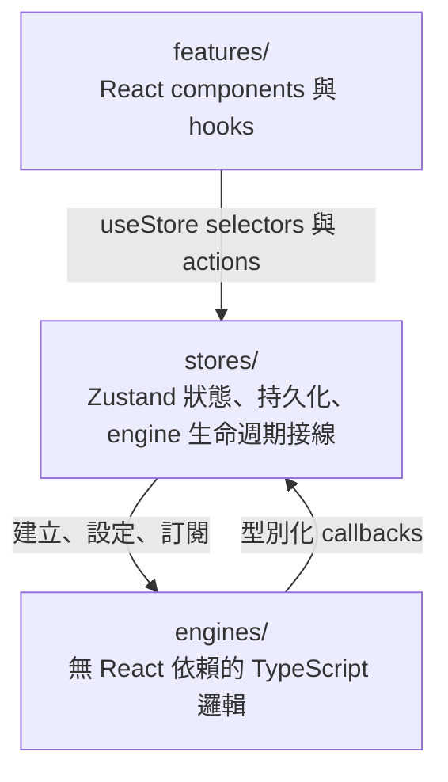
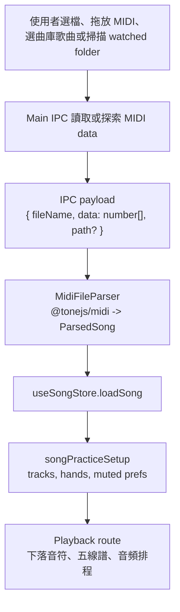
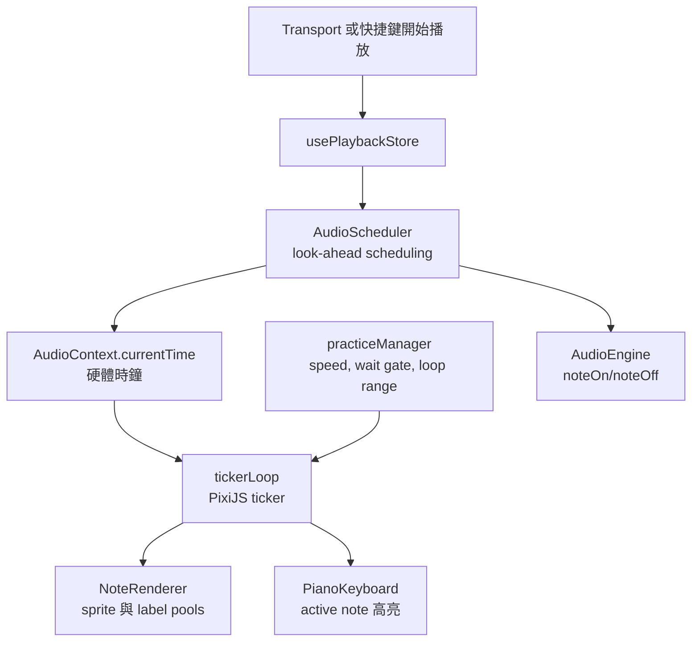
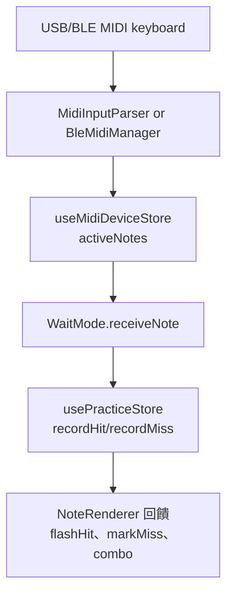
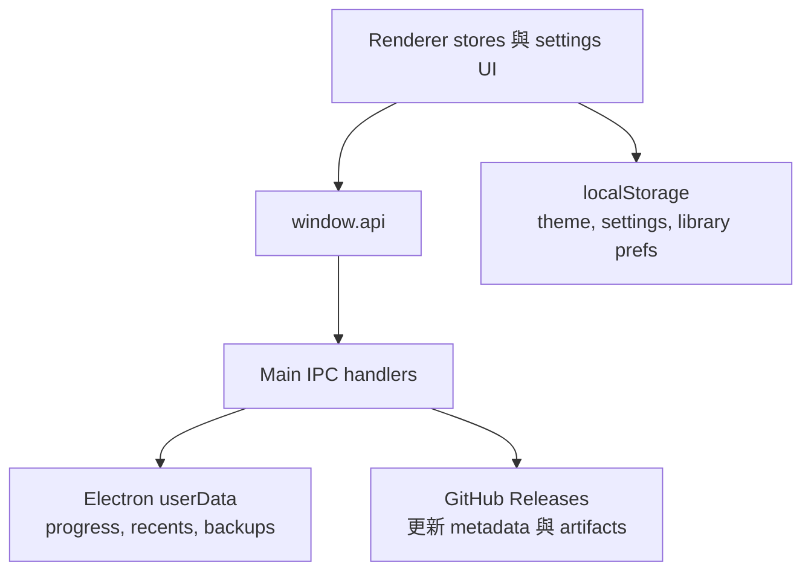

# Rexiano 架構總覽

> **TL;DR**：Rexiano 是 Electron 39 桌面應用，renderer 使用 React 19，核心邏輯放在純 TypeScript engines，Zustand stores 負責橋接狀態與 engine 生命週期，所有檔案系統與 app shell 能力都走 IPC。新增行為時維持既有分層：`main` 管原生能力，`preload` 暴露型別化 API，`stores` 協調狀態，`features` 渲染 UI，`engines` 保持無 React 依賴。
>
> **讀者**：開發者與貢獻者
>
> **最後更新**：2026-06
>
> Other languages: [English](./architecture.md)

## 技術堆疊

版本以 `package.json` 為準。

| 領域       | 目前選擇                                             | 備註                                                              |
| ---------- | ---------------------------------------------------- | ----------------------------------------------------------------- |
| Runtime    | Node `>=22 <23`、pnpm `10.33.2`                      | `packageManager` 固定為 pnpm 10。                                 |
| 桌面框架   | Electron `39.8.x`                                    | Main process 負責視窗、原生對話框、權限、更新與 user data 檔案。  |
| 建置       | electron-vite `5`、Vite `7`、TypeScript `5.9`        | `pnpm dev` 是一般 Electron 開發入口。                             |
| UI         | React `19`、Tailwind CSS `4`、Lucide React           | 主題色必須透過 CSS custom properties。                            |
| 狀態       | Zustand `5`                                          | Store 是一般 module，提供 selector 與 action。                    |
| 音樂與渲染 | PixiJS `8`、VexFlow `5`、`@tonejs/midi`、`midi-file` | PixiJS 負責下落音符；VexFlow 支援五線譜。                         |
| 音頻       | Web Audio API、`soundfont2`、`resources/piano.sf2`   | SoundFont 透過 IPC 以 `number[]` 載入；合成器 fallback 必須保留。 |
| 驗證       | Vitest `4`、Playwright `1.58`                        | Unit、e2e、visual 指令定義於 `package.json`。                     |

## 程序地圖

Electron 邊界要保持明確：原生與磁碟存取留在 `src/main`，renderer 只呼叫 `src/preload` 暴露的型別化 API，共用 IPC payload 定義放在 `src/shared/types.ts`。



### Main Process

| 模組                                                                         | 責任                                                                                                            |
| ---------------------------------------------------------------------------- | --------------------------------------------------------------------------------------------------------------- |
| `src/main/index.ts`                                                          | 建立 browser window、註冊 IPC handlers、處理 WSL2 顯示縮放、設定外部 URL policy，並管理 Electron app 生命週期。 |
| `src/main/ipc/fileHandlers.ts` 與 `midiPathAccess.ts`                        | 開啟 MIDI 檔、載入內建 MIDI、載入 SoundFont、匯出 MIDI，並驗證直接檔案路徑。                                    |
| `midiDeviceHandlers.ts` 與 `midiPermissionPolicy.ts`                         | 授權 Web MIDI 權限並列出 MIDI 裝置。                                                                            |
| `progressHandlers.ts`、`recentFilesHandlers.ts`、`userDataBackupHandlers.ts` | 讀寫練習紀錄、最近檔案與備份範圍等 user data。                                                                  |
| `watchedFolderHandlers.ts`                                                   | 選擇並掃描資料夾中的匯入 MIDI 檔。                                                                              |
| `appInfoHandlers.ts` 與 `updateHandlers.ts`                                  | 暴露 app 版本 / changelog，並處理 GitHub release 更新檢查與下載。                                               |

### Renderer Shell

`App.tsx` 是組合根節點。路由採用小型 hash route：`#/menu`、`#/library`、`#/playback`。如果已載入歌曲，`resolveRoute()` 會強制進入 playback；沒有歌曲時，playback route 會退回 menu。

主要使用者介面如下：

| 介面       | 模組                                                                                                        |
| ---------- | ----------------------------------------------------------------------------------------------------------- |
| 選單與曲庫 | `features/mainMenu`、`features/songLibrary`、`features/fileImport`、`features/onboarding`                   |
| 播放工作區 | `features/fallingNotes`、`features/sheetMusic`、`features/practice`、`features/audio`、`features/metronome` |
| 裝置與設定 | `features/midiDevice`、`features/midiDiagnostics`、`features/settings`                                      |
| 學習紀錄   | `features/insights`、`features/statistics`                                                                  |
| 編輯       | `features/editor`                                                                                           |
| 路由       | `features/routing/appRoute.ts`                                                                              |

## Renderer 分層

Renderer 程式碼遵守三層契約。



規則：

1. Engines 不匯入 React。
2. Features 不直接實例化 engines。
3. Store modules 橋接 React 與 engines，必要時管理 module-level singleton 生命週期。
4. PixiJS render loop 透過 `store.getState()` 讀 Zustand，不使用 React hooks。
5. Engine 與消費端的通信使用型別化 callback registration，不使用 `EventEmitter`。

## Stores

Rexiano 目前有八個 Zustand stores。

| Store                 | 主要狀態                                                                                                       | 持久化                                                               |
| --------------------- | -------------------------------------------------------------------------------------------------------------- | -------------------------------------------------------------------- |
| `useSongStore`        | 已載入的 `ParsedSong`、`loadSong()`、`clearSong()`                                                             | 無                                                                   |
| `usePlaybackStore`    | `currentTime`、`isPlaying`、`pixelsPerSecond`、音頻狀態、音量、音頻復原狀態                                    | 無                                                                   |
| `useThemeStore`       | `themeId`、`theme`、`setTheme()`                                                                               | `localStorage` key `rexiano-theme`                                   |
| `useMidiDeviceStore`  | Web MIDI inputs/outputs、選取裝置、active notes、BLE 狀態                                                      | 僅 runtime                                                           |
| `usePracticeStore`    | mode、speed、loop range、active tracks、hand assignments、track preferences、score、note results、display mode | 僅 runtime                                                           |
| `useSettingsStore`    | 標籤、指法、緊湊鍵名、語言、音量、預設練習值、節拍器、延遲補償、音頻相容模式、兒童專注模式                     | `localStorage` key `rexiano-settings`                                |
| `useProgressStore`    | 練習 session records、最佳成績查詢、近期 session 查詢、播放停止時 auto-save                                    | IPC 到 userData `progress.json`                                      |
| `useSongLibraryStore` | 內建曲目、匯入曲目、搜尋 / 篩選 / 排序 / view 狀態、favorites、watched folders                                 | `localStorage` key `rexiano-song-library`；watched folder 掃描走 IPC |

## Engines

Engines 需可獨立測試，並且不依賴 React。

| Engine 區域            | 主要模組                                                                                                                                 | 契約                                                                                                                |
| ---------------------- | ---------------------------------------------------------------------------------------------------------------------------------------- | ------------------------------------------------------------------------------------------------------------------- |
| `engines/audio`        | `AudioEngine`、`AudioScheduler`、`SoundFontLoader`、`recoveryUtils`                                                                      | 使用 `AudioContext.currentTime` 作為播放時鐘，look-ahead 排程，透過 IPC 載入 SoundFont，音頻失敗時復原或 fallback。 |
| `engines/fallingNotes` | `NoteRenderer`、`ViewportManager`、`tickerLoop`、`keyPositions`、`noteColors`、render diagnostics/stress fixtures                        | 以 PixiJS object pools 渲染可見音符，將 MIDI notes 映射到 88 鍵座標，並讓 60 FPS loop 留在 React 外。               |
| `engines/midi`         | `MidiFileParser`、`MidiDeviceManager`、`MidiInputParser`、`MidiOutputSender`、`BleMidiManager`、`TrackHandAssignment`、`MidiDiagnostics` | 將 MIDI 檔解析成以秒為單位的 `ParsedSong`，管理 Web MIDI / BLE MIDI 裝置，並暴露 note / CC callbacks。              |
| `engines/practice`     | `WaitMode`、`SpeedController`、`LoopController`、`ScoreCalculator`、`FingeringEngine`、`practiceManager`                                 | 練習邏輯保持 deterministic：wait-mode state machine、速度 clamping、A-B loop、評分、指法與 singleton 生命週期。     |
| `engines/metronome`    | `MetronomeEngine`、`metronomeManager`                                                                                                    | 透過 Web Audio 產生節拍器點擊與 count-in timing。                                                                   |

## 資料流

### MIDI 匯入與曲庫載入



Binary-like IPC payload 一律使用 `number[]`。只有在 renderer 或 loader 真的需要 typed array 時，才在邊界轉換。

### 播放、渲染與音頻



### MIDI 輸入與練習評分



### 持久化與 App Services



## 貢獻守則

保持變更小、可回復、符合分層：

1. 行為變更先寫最貼近的 Vitest 或 Playwright 失敗測試；純文件變更可不走 TDD，但仍需合理檢查。
2. 新增 module 前，先確認既有 stores 與 engines 是否已涵蓋該領域。
3. 公開時間值使用秒，不使用毫秒或 MIDI ticks。
4. 主題色定義在 `src/renderer/src/themes/tokens.ts`，元件透過 `var(--color-*)` 使用；語意狀態色是少數例外。
5. 字型維持既有 `@fontsource` 離線打包，不新增 CDN 字型。
6. Binary IPC payload 使用 `number[]`。
7. 只有完成被追蹤的 roadmap 任務時才更新 `docs/ROADMAP.md`；它是專案進度單一真實來源。
8. 文件中的圖表使用 Mermaid。

## 驗證與視覺回歸

用最小但足以覆蓋風險的指令開始；若改到共享行為或 UI，再擴大驗證。

| 變更類型                                       | 最小有用驗證                                                                                                | 何時擴大                                                                         |
| ---------------------------------------------- | ----------------------------------------------------------------------------------------------------------- | -------------------------------------------------------------------------------- |
| 純文件                                         | `pnpm exec prettier --check docs/architecture.md docs/architecture-zh.md`                                   | 修改範例或連結時，手動補查連結 / 指令。                                          |
| Engine、store、IPC 或 shared type              | 聚焦 `pnpm test -- <pattern>` 加 `pnpm typecheck`                                                           | 行為跨層或 PR 前執行 `pnpm lint && pnpm typecheck && pnpm test`。                |
| React feature 或互動                           | 聚焦 component/unit tests 加相關 Playwright spec，例如 `pnpm exec playwright test e2e/song-library.spec.ts` | 路由、匯入、設定、更新或持久化流程改動時執行 `pnpm test:e2e`。                   |
| Canvas、五線譜、accessibility 或 visual polish | `pnpm test:visual`                                                                                          | 只有檢查並接受 intentional snapshot changes 後，才用 `pnpm test:visual:update`。 |
| 打包、release 或 update flow                   | `pnpm build` 加相關 update/release Playwright 或 script test                                                | Release 驗收時才跑平台打包指令。                                                 |

一般完整本機 gate 維持：

```bash
pnpm lint && pnpm typecheck && pnpm test
```

## 參考文件

- [系統設計](./DESIGN.md)
- [英文系統設計](./DESIGN-en.md)
- [Roadmap](./ROADMAP.md)
- [初始產品需求](./init.md)
- [效能診斷](./performance-diagnostics.md)
- [SoundFont provenance](./soundfont-provenance.md)
