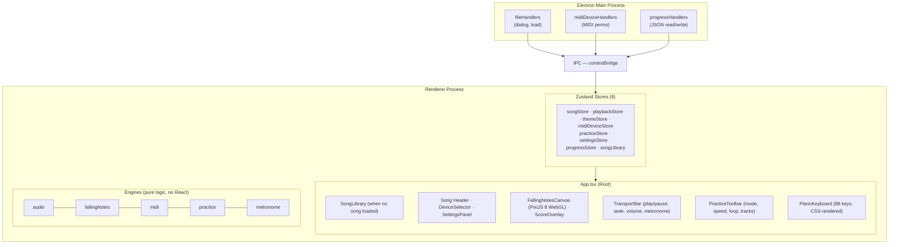
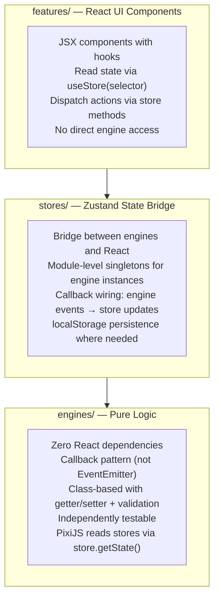
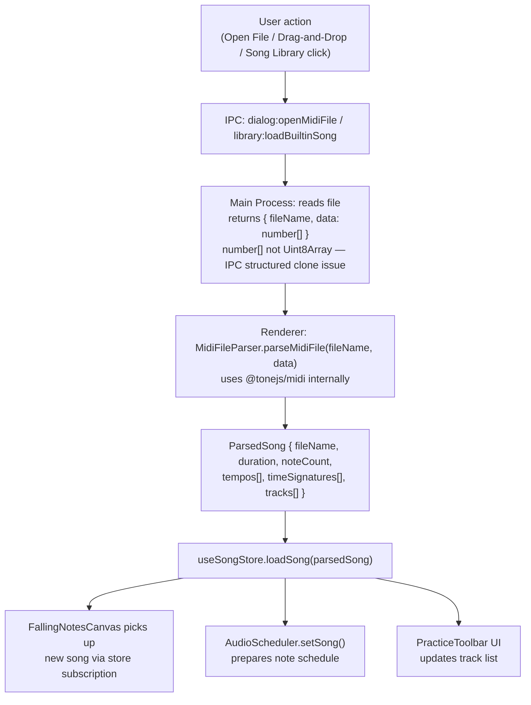
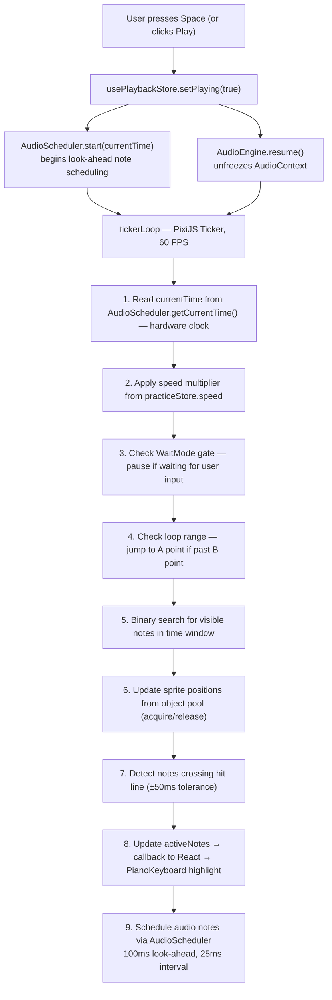
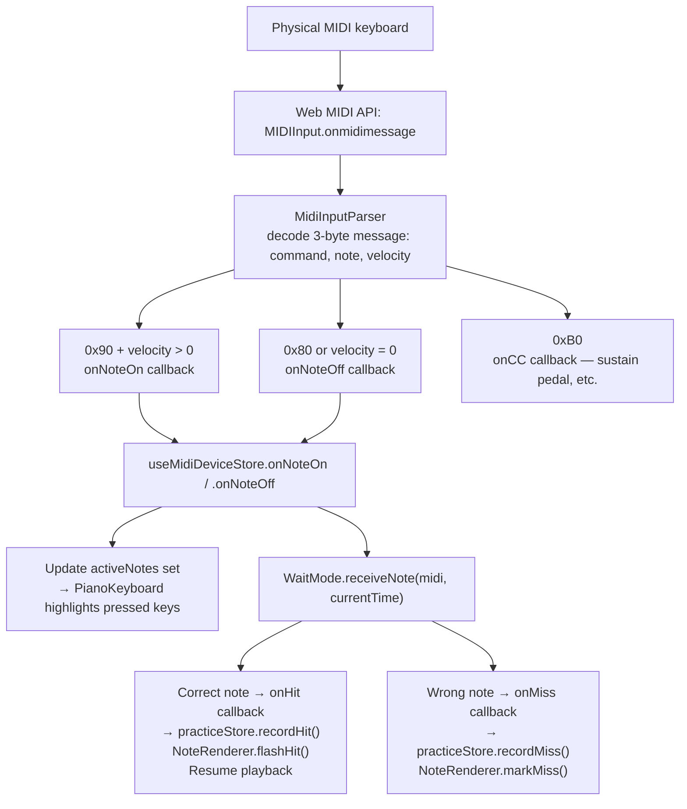
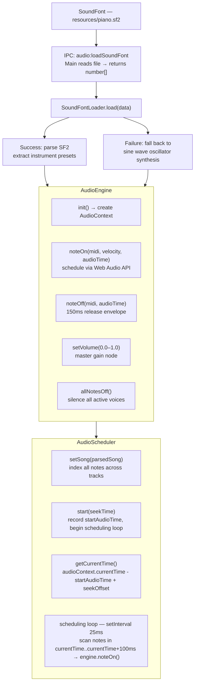

# Rexiano Architecture Overview

> **Audience**: Developers and contributors
> **Last updated**: 2026-03

---

## 1. Architecture Overview

Rexiano is an Electron desktop application with a clear separation between the main process (Node.js) and the renderer process (Chromium / React).



---

## 2. Tech Stack

| Layer            | Technology                                    | Version  | Purpose                                       |
| ---------------- | --------------------------------------------- | -------- | --------------------------------------------- |
| Desktop shell    | Electron                                      | 33       | Cross-platform window, system APIs, packaging |
| Build tooling    | electron-vite + Vite                          | 5 / 7    | Fast HMR, module bundling                     |
| UI framework     | React + TypeScript                            | 19 / 5.9 | Component-based UI                            |
| Styling          | Tailwind CSS + CSS Custom Properties          | 4        | Utility classes + theme system                |
| State management | Zustand                                       | 5        | Lightweight global stores                     |
| Canvas rendering | PixiJS                                        | 8        | WebGL falling notes at 60 FPS                 |
| MIDI parsing     | @tonejs/midi                                  | 2        | Parse `.mid` files into structured data       |
| Audio            | Web Audio API + soundfont2                    | --       | SoundFont playback with synth fallback        |
| Icons            | Lucide React                                  | --       | SVG icon library                              |
| Fonts            | @fontsource (Nunito, DM Sans, JetBrains Mono) | --       | Offline-bundled, no CDN dependency            |
| Testing          | Vitest                                        | 4        | Unit and component tests                      |
| Packaging        | electron-builder                              | 26       | Windows/macOS/Linux installers                |
| Package manager  | pnpm                                          | --       | Fast, disk-efficient                          |

---

## 3. Directory Structure

```
rexiano/
├── docs/                         # Design docs, roadmap, user guide
├── resources/                    # Static assets bundled with the app
│   ├── piano.sf2                 # SoundFont file (TimGM6mb, ~6 MB)
│   └── songs/                    # Built-in MIDI songs (18 files)
├── build/                        # electron-builder resources (icons, etc.)
├── src/
│   ├── main/                     # Electron main process
│   │   ├── index.ts              # Window creation, app lifecycle
│   │   └── ipc/
│   │       ├── fileHandlers.ts         # File dialog, MIDI file loading
│   │       ├── midiDeviceHandlers.ts   # MIDI permission auto-grant
│   │       ├── progressHandlers.ts     # Read/write progress.json
│   │       └── recentFilesHandlers.ts  # Read/write recents.json
│   ├── preload/                  # Electron context bridge
│   │   ├── index.ts              # API exposed to renderer
│   │   └── index.d.ts            # TypeScript declarations for window.api
│   ├── shared/
│   │   └── types.ts              # Shared types across processes
│   └── renderer/src/             # React frontend
│       ├── App.tsx               # Root component, lifecycle wiring
│       ├── main.tsx              # React entry point
│       ├── assets/
│       │   └── main.css          # Tailwind + @theme + font imports
│       ├── engines/              # Pure logic layer (no React deps)
│       │   ├── audio/            # Web Audio API + SoundFont
│       │   ├── fallingNotes/     # PixiJS rendering pipeline
│       │   ├── midi/             # MIDI parsing + device management
│       │   ├── practice/         # Practice mode state machines
│       │   └── metronome/        # Metronome timing + audio
│       ├── features/             # React UI components
│       │   ├── fallingNotes/     # Canvas, keyboard, transport bar
│       │   ├── midiDevice/       # Device selector, connection status
│       │   ├── practice/         # Practice toolbar, score, celebration
│       │   ├── settings/         # Settings panel, theme picker
│       │   ├── songLibrary/      # Song browser, cards, filters
│       │   ├── onboarding/       # First-run tutorial guide
│       │   ├── metronome/        # Beat pulse UI
│       │   ├── audio/            # Volume control
│       │   └── insights/         # (planned) Practice analytics
│       ├── stores/               # Zustand state management
│       ├── hooks/                # Custom React hooks
│       ├── themes/
│       │   └── tokens.ts         # Theme definitions (4 themes, 28 color tokens each)
│       ├── types/                # Renderer-specific type definitions
│       └── utils/                # Utility functions
├── electron-builder.yml          # Packaging configuration
├── electron.vite.config.ts       # Vite config for Electron
├── package.json                  # Dependencies and scripts
├── tsconfig.*.json               # TypeScript configurations
└── vitest.config.ts              # Test configuration
```

---

## 4. Layer Architecture

Rexiano enforces a strict three-layer architecture within the renderer process:



**Rules**:

1. **Engines never import React** — they are pure TypeScript classes/functions
2. **Stores bridge engines to React** — they hold module-level engine references and wire callbacks
3. **Features never instantiate engines directly** — they go through stores
4. **PixiJS code uses `store.getState()`** — to avoid React re-renders in the render loop
5. **New engines use the callback pattern** — `onSomething(callback)` methods, not EventEmitter

---

## 5. Data Flow

### 5.1 MIDI File Loading



### 5.2 Playback & Rendering Loop



### 5.3 MIDI Input → Practice Scoring



### 5.4 Audio Pipeline



---

## 6. Store Catalog

Rexiano uses 8 Zustand stores. All are created with `create<T>()()` (Zustand v5 syntax).

| Store                 | File                            | Key Fields                                                                                                                                             | Persistence                       |
| --------------------- | ------------------------------- | ------------------------------------------------------------------------------------------------------------------------------------------------------ | --------------------------------- |
| `useSongStore`        | `stores/useSongStore.ts`        | `song: ParsedSong \| null`, `loadSong()`, `clearSong()`                                                                                                | None                              |
| `usePlaybackStore`    | `stores/usePlaybackStore.ts`    | `currentTime`, `isPlaying`, `pixelsPerSecond`, `audioStatus`, `volume`                                                                                 | None                              |
| `useThemeStore`       | `stores/useThemeStore.ts`       | `themeId: ThemeId`, `theme: ThemeTokens`, `setTheme()`                                                                                                 | localStorage (`rexiano-theme`)    |
| `useMidiDeviceStore`  | `stores/useMidiDeviceStore.ts`  | `inputs[]`, `outputs[]`, `selectedInputId`, `isConnected`, `activeNotes: Set<number>`, `bleStatus`                                                     | None                              |
| `usePracticeStore`    | `stores/usePracticeStore.ts`    | `mode: PracticeMode`, `speed`, `loopRange`, `activeTracks: Set<number>`, `score: PracticeScore`, `noteResults: Map`                                    | None                              |
| `useSettingsStore`    | `stores/useSettingsStore.ts`    | `showNoteLabels`, `showFallingNoteLabels`, `volume`, `muted`, `defaultSpeed`, `defaultMode`, `metronomeEnabled`, `countInBeats`, `latencyCompensation` | localStorage (`rexiano-settings`) |
| `useProgressStore`    | `stores/useProgressStore.ts`    | `sessions: SessionRecord[]`, `isLoaded`, `addSession()`, `getBestScore()`                                                                              | IPC → `progress.json` in userData |
| `useSongLibraryStore` | `stores/useSongLibraryStore.ts` | `songs: BuiltinSongMeta[]`, `isLoading`, `searchQuery`, `difficultyFilter`                                                                             | None                              |

**Note**: `usePracticeStore` and `useMidiDeviceStore` use module-level variables (`_parser`, `_bleManager`) to manage engine singleton instances outside of the store itself.

---

## 7. Engine Catalog

All engines live under `src/renderer/src/engines/` and have **zero React dependencies**.

### audio/

| File                 | Class/Module      | Purpose                                                                                                                                                                     |
| -------------------- | ----------------- | --------------------------------------------------------------------------------------------------------------------------------------------------------------------------- |
| `AudioEngine.ts`     | `AudioEngine`     | Web Audio API wrapper. `init()` creates AudioContext, loads SoundFont. `noteOn()`/`noteOff()` schedule audio events. `setVolume()` controls master gain.                    |
| `AudioScheduler.ts`  | `AudioScheduler`  | Look-ahead scheduler. Runs a 25ms interval loop that pre-schedules notes 100ms ahead. Provides `getCurrentTime()` derived from `AudioContext.currentTime` (hardware clock). |
| `SoundFontLoader.ts` | `SoundFontLoader` | Parses SF2 files using the `soundfont2` library. Falls back to sine-wave oscillator synthesis if loading fails.                                                             |

### fallingNotes/

| File                 | Class/Module      | Purpose                                                                                                                                                                                                                                                             |
| -------------------- | ----------------- | ------------------------------------------------------------------------------------------------------------------------------------------------------------------------------------------------------------------------------------------------------------------- |
| `NoteRenderer.ts`    | `NoteRenderer`    | Manages a PixiJS sprite object pool (512 initial, grows by 50% when exhausted). Handles `acquire()`/`release()` lifecycle. Also manages a parallel text label pool for note names. Provides `flashHit()`, `markMiss()`, `showCombo()` for practice visual feedback. |
| `ViewportManager.ts` | `ViewportManager` | Maps between time coordinates (seconds) and screen coordinates (pixels). Computes visible time window, note Y positions, and hit line detection.                                                                                                                    |
| `keyPositions.ts`    | `keyPositions`    | Maps MIDI note numbers (21-108) to screen X coordinates for an 88-key piano layout. Handles white/black key widths and offsets.                                                                                                                                     |
| `noteColors.ts`      | `noteColors`      | Assigns colors to notes based on track index, reading from the current theme tokens.                                                                                                                                                                                |
| `tickerLoop.ts`      | `tickerLoop`      | The main render loop callback attached to PixiJS Ticker. Runs at 60 FPS. Handles time advancement, visible note culling (binary search), sprite updates, hit-line detection, WaitMode gating, speed multiplication, and loop-range detection.                       |

### midi/

| File                   | Class/Module                    | Purpose                                                                                                                                                         |
| ---------------------- | ------------------------------- | --------------------------------------------------------------------------------------------------------------------------------------------------------------- |
| `MidiFileParser.ts`    | `parseMidiFile()`               | Converts raw MIDI bytes into a `ParsedSong` using `@tonejs/midi`. Filters empty tracks, normalizes time to seconds.                                             |
| `MidiDeviceManager.ts` | `MidiDeviceManager` (Singleton) | Wraps `navigator.requestMIDIAccess()`. Tracks available inputs/outputs, handles device hot-plug via `onstatechange`. Supports auto-reconnect via `lastInputId`. |
| `MidiInputParser.ts`   | `MidiInputParser`               | Decodes raw MIDI messages (3-byte arrays). Fires `onNoteOn`/`onNoteOff`/`onCC` callbacks. Handles edge cases like velocity-0 Note On (= Note Off).              |
| `MidiOutputSender.ts`  | `MidiOutputSender`              | Sends MIDI messages to an output device. `noteOn()`, `noteOff()`, `sendCC()`, `allNotesOff()`, and `sendParsedNote()` for demo mode.                            |
| `BleMidiManager.ts`    | `BleMidiManager`                | Web Bluetooth API integration for direct BLE MIDI connections. Handles GATT service/characteristic discovery and MIDI message parsing from BLE packets.         |

### practice/

| File                 | Class/Module      | Purpose                                                                                                                                                                                                          |
| -------------------- | ----------------- | ---------------------------------------------------------------------------------------------------------------------------------------------------------------------------------------------------------------- |
| `WaitMode.ts`        | `WaitMode`        | State machine (`playing` / `waiting` / `idle`) that pauses playback when the next chord arrives. Collects notes within a +/-200ms window as a chord group. Fires `onWait`/`onResume`/`onHit`/`onMiss` callbacks. |
| `SpeedController.ts` | `SpeedController` | Speed multiplier management (0.25x-2.0x) with clamping and validation.                                                                                                                                           |
| `LoopController.ts`  | `LoopController`  | A-B loop logic. `shouldLoop(currentTime)` returns true when past B point. Provides `getLoopStart()` for jump-back target.                                                                                        |
| `ScoreCalculator.ts` | `ScoreCalculator` | Accumulates hit/miss counts, computes accuracy percentage, tracks current and best streak.                                                                                                                       |
| `practiceManager.ts` | `practiceManager` | Module-level singleton manager. `initPracticeEngines()` creates WaitMode + SpeedController + LoopController + ScoreCalculator. `getPracticeEngines()` returns them. `disposePracticeEngines()` tears down.       |

### metronome/

| File                  | Class/Module       | Purpose                                                                                                                                              |
| --------------------- | ------------------ | ---------------------------------------------------------------------------------------------------------------------------------------------------- |
| `MetronomeEngine.ts`  | `MetronomeEngine`  | Generates metronome click sounds via Web Audio API oscillator. Supports accent on beat 1. Provides count-in functionality (configurable beat count). |
| `metronomeManager.ts` | `metronomeManager` | Module-level singleton manager for MetronomeEngine lifecycle.                                                                                        |

---

## 8. Key Design Decisions

### Why PixiJS instead of DOM rendering?

A typical MIDI file can have 500-5000 notes visible at once. DOM-based rendering (CSS/React elements) starts dropping frames around 200 elements. PixiJS renders via WebGL, handling thousands of sprites at 60 FPS with an object pool that avoids GC pressure. The pool starts at 512 sprites and grows by 50% (minimum 64) when exhausted.

### Why callback pattern instead of EventEmitter?

Engines use a simple callback registration pattern (`onSomething(cb: (arg) => void)`):

```typescript
// Engine
class WaitMode {
  private _onHit: ((noteKey: string) => void) | null = null;
  onHit(cb: (noteKey: string) => void): void {
    this._onHit = cb;
  }
}

// Consumer
waitMode.onHit((noteKey) => practiceStore.recordHit(noteKey));
```

Advantages over EventEmitter:

- **Type safety**: callbacks are fully typed at the registration site
- **Simplicity**: no string-based event names, no listener management complexity
- **Predictability**: one callback per event type (no multi-listener ordering issues)
- **Bundle size**: no EventEmitter import needed

### Why does IPC use `number[]` instead of `Uint8Array`?

Electron's structured clone algorithm loses the `Uint8Array` type when serializing across the IPC boundary. The data arrives in the renderer as a plain object, not a typed array. By converting to `number[]` in the main process and converting back to `Uint8Array` in the renderer, we avoid subtle runtime bugs. Defined in `src/shared/types.ts`:

```typescript
interface MidiFileResult {
  fileName: string;
  data: number[]; // not Uint8Array
}
```

### Why CSS Custom Properties for theming?

Rexiano supports 4 themes (Lavender, Ocean, Peach, Midnight) that can be switched at runtime. CSS Custom Properties allow instant theme switching without re-rendering the React tree:

1. Theme tokens are defined in `themes/tokens.ts` (28 color values per theme)
2. `useThemeStore.setTheme()` calls `applyThemeToDOM()` which sets `--color-*` variables on `:root`
3. All components reference colors via `var(--color-bg)`, `var(--color-accent)`, etc.
4. PixiJS colors are converted via `hexToPixi()` and read directly from theme tokens

This approach means adding a new theme requires only adding a new entry to `tokens.ts` — no component changes needed.

### Why Zustand over Redux or Context?

- **Minimal boilerplate**: stores are plain objects with methods, no actions/reducers
- **Direct access from PixiJS**: `store.getState()` works outside React, critical for the 60 FPS render loop
- **Selective subscriptions**: `useStore(selector)` prevents unnecessary re-renders
- **Small bundle**: ~2 KB gzipped

### Why module-level singletons for engine management?

Engine instances (practice, metronome, BLE MIDI) are managed as module-level variables in dedicated manager files:

```typescript
// practiceManager.ts
let _waitMode: WaitMode | null = null;
let _speedCtrl: SpeedController | null = null;

export function initPracticeEngines() { ... }
export function getPracticeEngines() { return { waitMode: _waitMode, ... }; }
export function disposePracticeEngines() { _waitMode = null; ... }
```

This pattern was chosen over class-based singletons because:

- Simpler lifecycle (init/get/dispose vs. getInstance with lazy init)
- Multiple related instances can be created and disposed together
- Import-based access is more ergonomic than `.getInstance()` chains

---

## 9. Testing Strategy

### Framework

- **Vitest 4** — fast, Vite-native test runner with TypeScript support out of the box
- **42 test files** across the codebase
- Run all tests: `pnpm test` (or `pnpm test:watch` for watch mode)

### Test File Location

Tests are co-located with their source files using the `*.test.ts` naming convention:

```
engines/audio/AudioEngine.ts
engines/audio/AudioEngine.test.ts     ← right next to it

stores/usePracticeStore.ts
stores/usePracticeStore.test.ts       ← right next to it
```

### What Gets Tested

| Layer        | What                                    | Examples                                                                                                                                    |
| ------------ | --------------------------------------- | ------------------------------------------------------------------------------------------------------------------------------------------- |
| Engines      | Pure logic classes                      | WaitMode state transitions, ScoreCalculator accuracy, SpeedController clamping, LoopController boundaries, MidiInputParser message decoding |
| Stores       | Zustand store actions                   | recordHit/recordMiss updates, device list sync, settings persistence                                                                        |
| Features     | React components (render + interaction) | PianoKeyboard key highlighting, TransportBar controls, CelebrationOverlay thresholds                                                        |
| IPC handlers | Main process handlers                   | Progress file read/write, recent files management                                                                                           |
| Integration  | Cross-module flows                      | Full playback integration test (`integration.test.ts`)                                                                                      |

### Mocking Patterns

- **Web MIDI API**: Mock `MIDIInput`/`MIDIOutput` with `as unknown as MIDIInput` type assertions
- **PixiJS**: Mock `Application`, `Container`, `Sprite`, `Ticker` — tests verify logic, not rendering
- **AudioContext**: Mock `createOscillator()`, `createGain()`, etc.
- **localStorage**: Vitest's `jsdom` provides a working localStorage for persistence tests
- **IPC (`window.api`)**: Mock via `vi.stubGlobal()` or direct assignment

### Verification Command

```bash
pnpm lint && pnpm typecheck && pnpm test
```

This is the standard verification command run after every change. It checks:

1. ESLint rules (code style, React hooks rules, etc.)
2. TypeScript type checking (both `tsconfig.node.json` and `tsconfig.web.json`)
3. All Vitest test suites

---

## 10. Contributing Guide

### Prerequisites

- Node.js 20+
- pnpm 9+
- A code editor with TypeScript support (VS Code recommended)

### Getting Started

```bash
git clone https://github.com/nickhsu-endea/Rexiano.git
cd Rexiano
pnpm install
pnpm dev          # starts Electron in development mode with HMR
```

### Branch Strategy

| Branch      | Purpose                              |
| ----------- | ------------------------------------ |
| `main`      | Stable release branch                |
| `dev`       | Development integration branch       |
| `feature/*` | Feature branches (branch from `dev`) |
| `fix/*`     | Bug fix branches (branch from `dev`) |

### Pull Request Process

1. Create a feature or fix branch from `dev`
2. Implement your changes following the layer architecture (engines → stores → features)
3. Add or update tests for your changes
4. Run `pnpm lint && pnpm typecheck && pnpm test` — all must pass
5. Update `docs/ROADMAP.md` checkboxes if completing a tracked task
6. Open a PR against `dev` with a clear description of what and why
7. Request a code review

### Code Style

- **TypeScript**: strict mode, no `any` unless absolutely necessary
- **Formatting**: Prettier (configured via `.prettierrc.yaml`)
- **Linting**: ESLint with `@electron-toolkit/eslint-config-ts` and React plugin
- **Naming**:
  - Files: PascalCase for classes/components (`AudioEngine.ts`, `PianoKeyboard.tsx`), camelCase for utilities (`keyPositions.ts`, `tokens.ts`)
  - Stores: `use<Name>Store.ts` (Zustand convention)
  - Tests: `<source>.test.ts` (co-located)
- **Imports**: use path aliases (`@renderer/`, `@shared/`) defined in tsconfig

### Architecture Rules (must follow)

1. **Engines must not import React** — if you need React state, read it via `store.getState()`
2. **Use callback pattern for engine-to-consumer communication** — not EventEmitter, not direct store imports
3. **New state goes in an existing store first** — only create a new store if the domain is clearly separate
4. **Theme colors must use CSS Custom Properties** — never hard-code colors in components (exception: semantic colors like connection status green/red)
5. **All time values are in seconds** — never use milliseconds or ticks in public APIs
6. **IPC transfers use `number[]` for binary data** — convert to/from `Uint8Array` at the boundaries

### Reference Documentation

- **`docs/DESIGN.md`** — authoritative architecture reference with detailed phase designs
- **`docs/ROADMAP.md`** — task checklist (the single source of truth for project progress)
- **`CLAUDE.md`** — development conventions and quick reference (for AI-assisted development)

---

_Rexiano is licensed under GPL-3.0. See [LICENSE](../LICENSE) for details._
