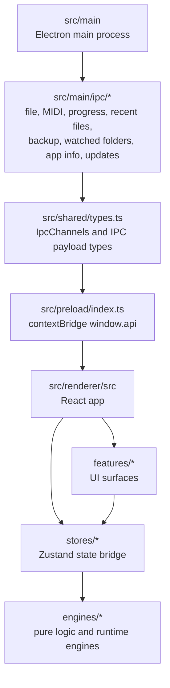
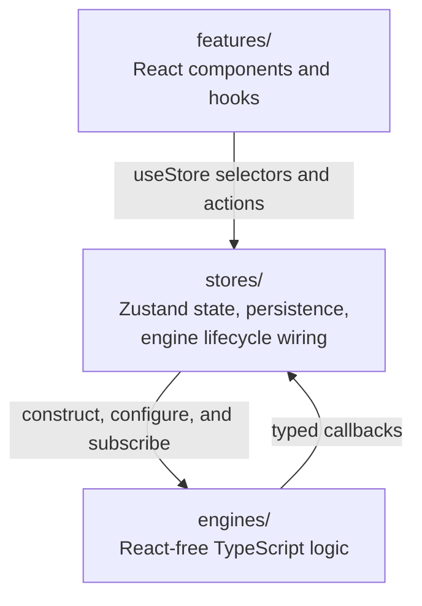
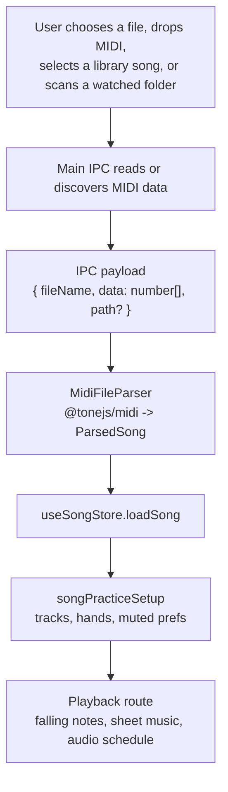
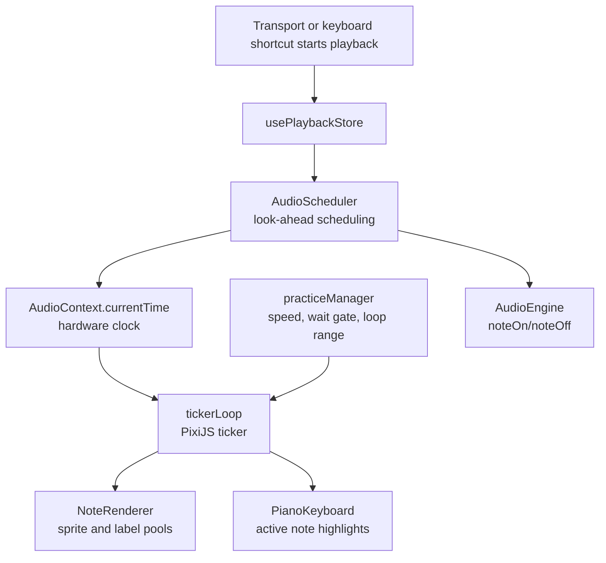
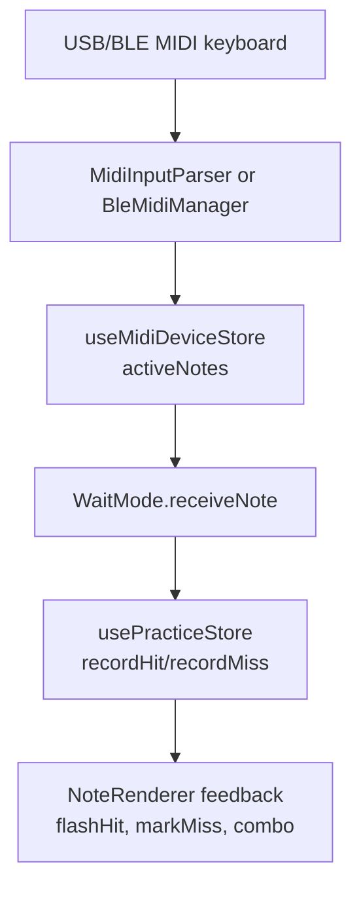
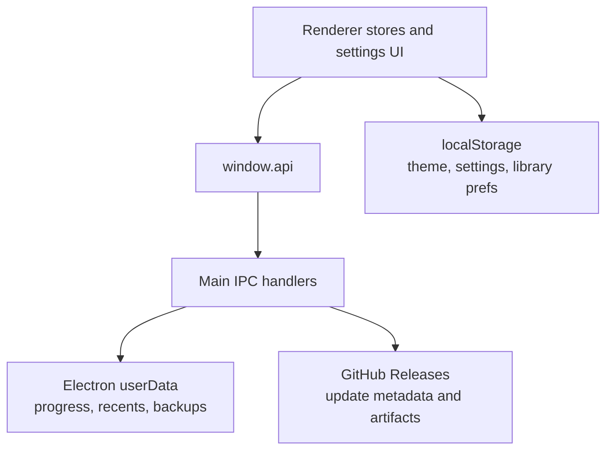

# Rexiano Architecture Overview

> **TL;DR**: Rexiano is an Electron 39 desktop app with a React 19 renderer, pure TypeScript engines, Zustand stores as the bridge, and IPC for all file-system and app-shell work. Keep new behavior inside the existing layers: `main` owns native capabilities, `preload` exposes typed APIs, `stores` coordinate state and engine lifecycles, `features` render UI, and `engines` stay React-free.
>
> **Audience**: Developers and contributors
>
> **Last updated**: 2026-06
>
> Other languages: [繁體中文](./architecture-zh.md)

## Stack

Use `package.json` as the version source of truth.

| Area            | Current choice                                       | Notes                                                                                 |
| --------------- | ---------------------------------------------------- | ------------------------------------------------------------------------------------- |
| Runtime         | Node `>=22 <23`, pnpm `10.33.2`                      | `packageManager` is pinned to pnpm 10.                                                |
| Desktop shell   | Electron `39.8.x`                                    | Main process owns windows, native dialogs, permissions, updates, and user data files. |
| Build           | electron-vite `5`, Vite `7`, TypeScript `5.9`        | `pnpm dev` is the normal Electron dev entry.                                          |
| UI              | React `19`, Tailwind CSS `4`, Lucide React           | Theme color must flow through CSS custom properties.                                  |
| State           | Zustand `5`                                          | Stores are plain modules with selectors and actions.                                  |
| Music/rendering | PixiJS `8`, VexFlow `5`, `@tonejs/midi`, `midi-file` | PixiJS drives falling notes; VexFlow supports sheet music.                            |
| Audio           | Web Audio API, `soundfont2`, `resources/piano.sf2`   | SoundFont is loaded through IPC as `number[]`; synth fallback remains required.       |
| Verification    | Vitest `4`, Playwright `1.58`                        | Unit, e2e, and visual commands are defined in `package.json`.                         |

## Process Map

The Electron boundary is strict: native and disk access stays in `src/main`, renderer code calls typed APIs exposed by `src/preload`, and shared IPC payloads live in `src/shared/types.ts`.


```mermaid
flowchart TB
    Main["src/main\nElectron main process"]
    IPC["src/main/ipc/*\nfile, MIDI, progress, recent files,\nbackup, watched folders, app info, updates"]
    Preload["src/preload/index.ts\ncontextBridge window.api"]
    Shared["src/shared/types.ts\nIpcChannels and IPC payload types"]
    Renderer["src/renderer/src\nReact app"]
    Stores["stores/*\nZustand state bridge"]
    Features["features/*\nUI surfaces"]
    Engines["engines/*\npure logic and runtime engines"]

    Main --> IPC
    IPC --> Shared
    Shared --> Preload
    Preload --> Renderer
    Renderer --> Stores
    Renderer --> Features
    Stores --> Engines
    Features --> Stores
```

### Main Process

| Module                                                                       | Responsibility                                                                                                                                        |
| ---------------------------------------------------------------------------- | ----------------------------------------------------------------------------------------------------------------------------------------------------- |
| `src/main/index.ts`                                                          | Creates the browser window, registers IPC handlers, handles WSL2 display scaling, configures external URL policy, and manages Electron app lifecycle. |
| `src/main/ipc/fileHandlers.ts` and `midiPathAccess.ts`                       | Open MIDI files, load built-in MIDI files, load SoundFont files, export MIDI, and validate direct file paths.                                         |
| `midiDeviceHandlers.ts` and `midiPermissionPolicy.ts`                        | Grant Web MIDI permissions and list MIDI devices.                                                                                                     |
| `progressHandlers.ts`, `recentFilesHandlers.ts`, `userDataBackupHandlers.ts` | Read/write user data such as practice sessions, recent files, and backup scopes.                                                                      |
| `watchedFolderHandlers.ts`                                                   | Select and scan folders for imported MIDI files.                                                                                                      |
| `appInfoHandlers.ts` and `updateHandlers.ts`                                 | Expose app version/changelog and GitHub release update checks/downloads.                                                                              |

### Renderer Shell

`App.tsx` is the composition root. Route state is hash-based and intentionally small: `#/menu`, `#/library`, and `#/playback`. If a song is loaded, `resolveRoute()` forces playback; without a song, playback routes fall back to menu.

The main user surfaces are:

| Surface             | Modules                                                                                                     |
| ------------------- | ----------------------------------------------------------------------------------------------------------- |
| Menu and library    | `features/mainMenu`, `features/songLibrary`, `features/fileImport`, `features/onboarding`                   |
| Playback workspace  | `features/fallingNotes`, `features/sheetMusic`, `features/practice`, `features/audio`, `features/metronome` |
| Device and settings | `features/midiDevice`, `features/midiDiagnostics`, `features/settings`                                      |
| Learning records    | `features/insights`, `features/statistics`                                                                  |
| Editing             | `features/editor`                                                                                           |
| Routing             | `features/routing/appRoute.ts`                                                                              |

## Renderer Layers

Renderer code follows a three-layer contract.


```mermaid
flowchart TB
    Features["features/\nReact components and hooks"]
    Stores["stores/\nZustand state, persistence,\nengine lifecycle wiring"]
    Engines["engines/\nReact-free TypeScript logic"]

    Features -->|"useStore selectors and actions"| Stores
    Stores -->|"construct, configure, and subscribe"| Engines
    Engines -->|"typed callbacks"| Stores
```

Rules:

1. Engines do not import React.
2. Features do not instantiate engines directly.
3. Store modules bridge React and engines, including module-level singleton lifecycles where needed.
4. PixiJS render-loop code reads Zustand through `store.getState()` rather than React hooks.
5. Engine communication uses typed callback registration, not `EventEmitter`.

## Stores

Rexiano currently has eight Zustand stores.

| Store                 | Main state                                                                                                               | Persistence                                                             |
| --------------------- | ------------------------------------------------------------------------------------------------------------------------ | ----------------------------------------------------------------------- |
| `useSongStore`        | Loaded `ParsedSong`, `loadSong()`, `clearSong()`                                                                         | None                                                                    |
| `usePlaybackStore`    | `currentTime`, `isPlaying`, `pixelsPerSecond`, audio status, volume, audio recovery state                                | None                                                                    |
| `useThemeStore`       | `themeId`, `theme`, `setTheme()`                                                                                         | `localStorage` key `rexiano-theme`                                      |
| `useMidiDeviceStore`  | Web MIDI inputs/outputs, selected devices, active notes, BLE status                                                      | Runtime only                                                            |
| `usePracticeStore`    | mode, speed, loop range, active tracks, hand assignments, track preferences, score, note results, display mode           | Runtime only                                                            |
| `useSettingsStore`    | labels, fingering, compact labels, language, volume, defaults, metronome, latency, audio compatibility, child focus mode | `localStorage` key `rexiano-settings`                                   |
| `useProgressStore`    | practice session records, best score lookup, recent session lookup, auto-save on playback stop                           | IPC to userData `progress.json`                                         |
| `useSongLibraryStore` | built-in songs, imported songs, search/filter/sort/view state, favorites, watched folders                                | `localStorage` key `rexiano-song-library`; watched folder scans use IPC |

## Engines

Engines are independently testable and should remain usable without React.

| Engine area            | Key modules                                                                                                                              | Contract                                                                                                                                       |
| ---------------------- | ---------------------------------------------------------------------------------------------------------------------------------------- | ---------------------------------------------------------------------------------------------------------------------------------------------- |
| `engines/audio`        | `AudioEngine`, `AudioScheduler`, `SoundFontLoader`, `recoveryUtils`                                                                      | Use `AudioContext.currentTime` as playback clock, schedule with look-ahead, load SoundFont through IPC, recover or fall back when audio fails. |
| `engines/fallingNotes` | `NoteRenderer`, `ViewportManager`, `tickerLoop`, `keyPositions`, `noteColors`, render diagnostics/stress fixtures                        | Render visible notes with PixiJS object pools, map MIDI notes to 88-key coordinates, and keep the 60 FPS loop outside React.                   |
| `engines/midi`         | `MidiFileParser`, `MidiDeviceManager`, `MidiInputParser`, `MidiOutputSender`, `BleMidiManager`, `TrackHandAssignment`, `MidiDiagnostics` | Parse MIDI files into seconds-based `ParsedSong`, manage Web MIDI/BLE MIDI devices, and expose note/CC callbacks.                              |
| `engines/practice`     | `WaitMode`, `SpeedController`, `LoopController`, `ScoreCalculator`, `FingeringEngine`, `practiceManager`                                 | Keep practice logic deterministic: wait-mode state machine, speed clamping, A-B looping, scoring, fingering, and singleton lifecycle.          |
| `engines/metronome`    | `MetronomeEngine`, `metronomeManager`                                                                                                    | Generate metronome clicks and count-in timing through Web Audio.                                                                               |

## Data Flows

### MIDI Import and Library Loading


```mermaid
flowchart TD
    User["User chooses a file, drops MIDI,\nselects a library song, or scans a watched folder"]
    Main["Main IPC reads or discovers MIDI data"]
    Payload["IPC payload\n{ fileName, data: number[], path? }"]
    Parse["MidiFileParser\n@tonejs/midi -> ParsedSong"]
    SongStore["useSongStore.loadSong"]
    PracticeSetup["songPracticeSetup\ntracks, hands, muted prefs"]
    Playback["Playback route\nfalling notes, sheet music, audio schedule"]

    User --> Main --> Payload --> Parse --> SongStore
    SongStore --> PracticeSetup --> Playback
```

Use `number[]` for binary-like IPC payloads. Convert to typed arrays only inside the renderer or loader that needs them.

### Playback, Rendering, and Audio


```mermaid
flowchart TD
    Play["Transport or keyboard shortcut starts playback"]
    PlaybackStore["usePlaybackStore"]
    Scheduler["AudioScheduler\nlook-ahead scheduling"]
    Clock["AudioContext.currentTime\nhardware clock"]
    Ticker["tickerLoop\nPixiJS ticker"]
    Practice["practiceManager\nspeed, wait gate, loop range"]
    Renderer["NoteRenderer\nsprite and label pools"]
    Keyboard["PianoKeyboard\nactive note highlights"]
    Audio["AudioEngine\nnoteOn/noteOff"]

    Play --> PlaybackStore --> Scheduler --> Clock --> Ticker
    Practice --> Ticker
    Ticker --> Renderer
    Ticker --> Keyboard
    Scheduler --> Audio
```

### MIDI Input and Practice Scoring


```mermaid
flowchart TD
    Device["USB/BLE MIDI keyboard"]
    Parser["MidiInputParser or BleMidiManager"]
    DeviceStore["useMidiDeviceStore\nactiveNotes"]
    WaitMode["WaitMode.receiveNote"]
    Score["usePracticeStore\nrecordHit/recordMiss"]
    Visuals["NoteRenderer feedback\nflashHit, markMiss, combo"]

    Device --> Parser --> DeviceStore
    DeviceStore --> WaitMode --> Score --> Visuals
```

### Persistence and App Services


```mermaid
flowchart TD
    Renderer["Renderer stores and settings UI"]
    Preload["window.api"]
    IPC["Main IPC handlers"]
    UserData["Electron userData\nprogress, recents, backups"]
    GitHub["GitHub Releases\nupdate metadata and artifacts"]
    LocalStorage["localStorage\ntheme, settings, library prefs"]

    Renderer --> LocalStorage
    Renderer --> Preload --> IPC
    IPC --> UserData
    IPC --> GitHub
```

## Contribution Guardrails

Keep changes small and layer-aligned:

1. For behavior changes, start with the closest failing Vitest or Playwright test; documentation-only edits can skip TDD but still need a reasonable check.
2. Use existing stores and engines before adding new modules.
3. Keep public time values in seconds, not milliseconds or MIDI ticks.
4. Keep theme colors in `src/renderer/src/themes/tokens.ts` and consume them via `var(--color-*)`; semantic status colors are the rare exception.
5. Keep fonts offline through existing `@fontsource` packages; do not add CDN fonts.
6. Keep binary IPC payloads as `number[]`.
7. Update `docs/ROADMAP.md` only when a tracked roadmap task is completed; it is the project progress source of truth.
8. Use Mermaid for diagrams in docs.

## Verification and Visual Regression

Run the smallest command set that covers the risk, then expand when shared behavior or UI changes are involved.

| Change type                                          | Minimum useful verification                                                                                              | When to expand                                                                                  |
| ---------------------------------------------------- | ------------------------------------------------------------------------------------------------------------------------ | ----------------------------------------------------------------------------------------------- |
| Docs only                                            | `pnpm exec prettier --check docs/architecture.md docs/architecture-zh.md`                                                | Add link/command checks manually when changing examples.                                        |
| Engine, store, IPC, or shared type change            | Focused `pnpm test -- <pattern>` plus `pnpm typecheck`                                                                   | Run `pnpm lint && pnpm typecheck && pnpm test` before PR or when behavior crosses layers.       |
| React feature or interaction change                  | Focused component/unit tests plus relevant Playwright spec, such as `pnpm exec playwright test e2e/song-library.spec.ts` | Run `pnpm test:e2e` for route, import, settings, update, or persistence flows.                  |
| Canvas, sheet music, accessibility, or visual polish | `pnpm test:visual`                                                                                                       | Use `pnpm test:visual:update` only after inspecting and accepting intentional snapshot changes. |
| Packaging, release, or update flow                   | `pnpm build` plus the relevant update/release Playwright or script test                                                  | Run platform packaging commands only for release validation.                                    |

The normal full local gate remains:

```bash
pnpm lint && pnpm typecheck && pnpm test
```

## References

- [System design](./DESIGN.md)
- [English system design](./DESIGN-en.md)
- [Roadmap](./ROADMAP.md)
- [Initial product brief](./init.md)
- [Performance diagnostics](./performance-diagnostics.md)
- [SoundFont provenance](./soundfont-provenance.md)
