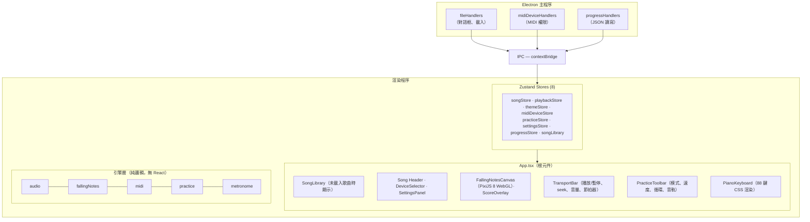
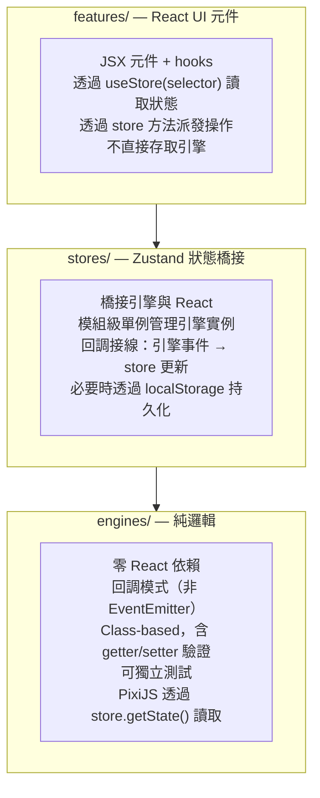
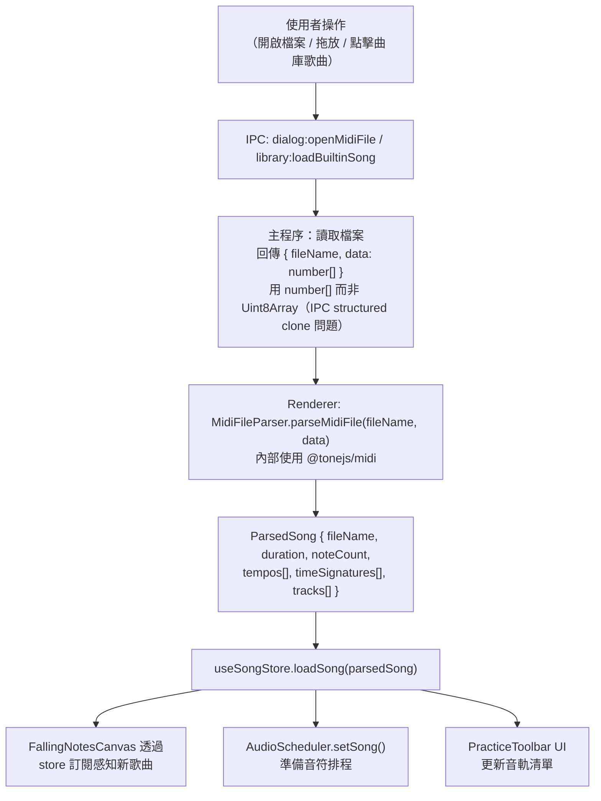
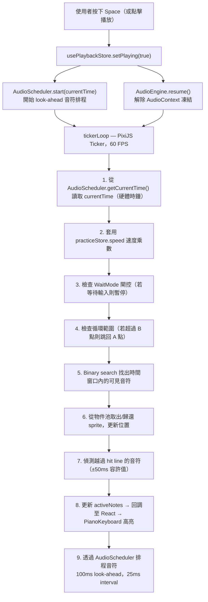
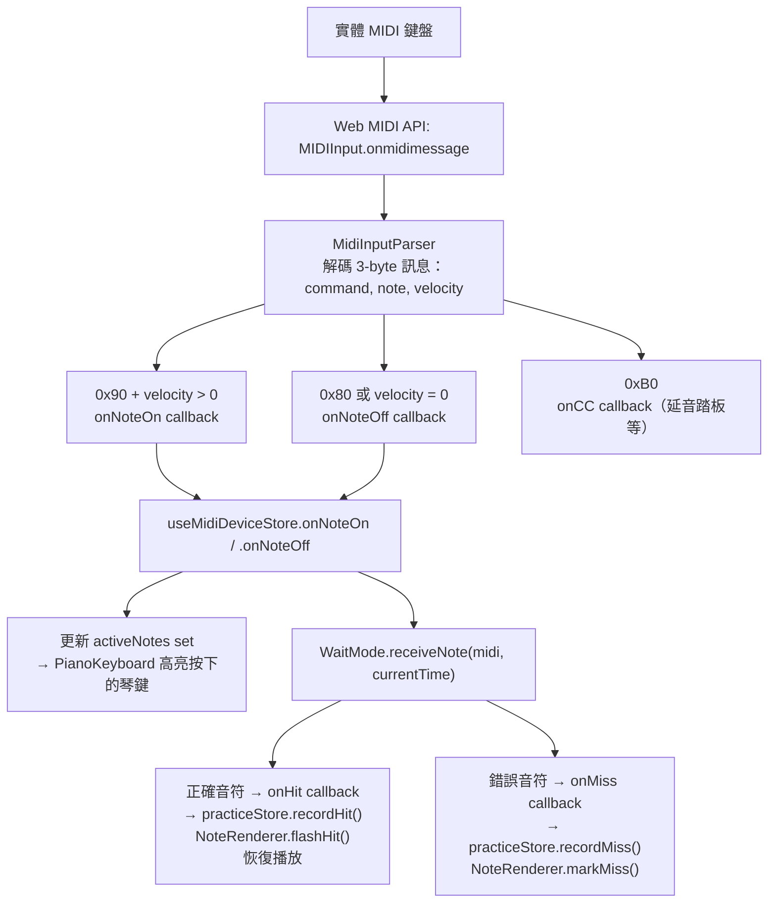
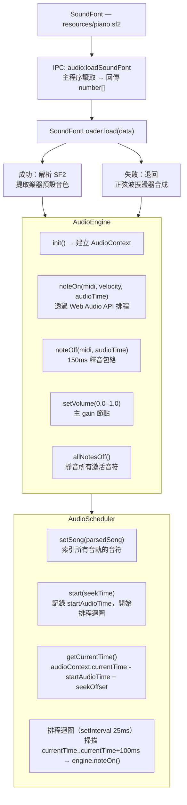

# Rexiano 架構總覽

> **讀者**：開發者與貢獻者
> **最後更新**：2026-03
>
> Other languages: [English](./architecture.md)

---

## 1. 架構概覽

Rexiano 是一個 Electron 桌面應用程式，在主程序（Node.js）和渲染程序（Chromium / React）之間有清晰的分層。



---

## 2. 技術堆疊

| 層級        | 技術                                          | 版本     | 用途                              |
| ----------- | --------------------------------------------- | -------- | --------------------------------- |
| 桌面框架    | Electron                                      | 33       | 跨平台視窗、系統 API、打包        |
| 建置工具    | electron-vite + Vite                          | 5 / 7    | 快速 HMR、模組打包                |
| UI 框架     | React + TypeScript                            | 19 / 5.9 | 元件化 UI                         |
| 樣式        | Tailwind CSS + CSS Custom Properties          | 4        | 工具類別 + 主題系統               |
| 狀態管理    | Zustand                                       | 5        | 輕量全域狀態                      |
| Canvas 渲染 | PixiJS                                        | 8        | WebGL 下落音符（60 FPS）          |
| MIDI 解析   | @tonejs/midi                                  | 2        | 解析 `.mid` 檔案為結構化資料      |
| 音頻        | Web Audio API + soundfont2                    | —        | SoundFont 播放，含合成器 fallback |
| 圖示        | Lucide React                                  | —        | SVG 圖示庫                        |
| 字型        | @fontsource (Nunito, DM Sans, JetBrains Mono) | —        | 離線字型，無 CDN 依賴             |
| 測試        | Vitest                                        | 4        | 單元測試與元件測試                |
| 打包        | electron-builder                              | 26       | Windows/macOS/Linux 安裝檔        |
| 套件管理    | pnpm                                          | —        | 快速、節省磁碟空間                |

---

## 3. 目錄結構

```
rexiano/
├── docs/                         # 設計文件、路線圖、使用手冊
├── resources/                    # 應用程式靜態資源
│   ├── piano.sf2                 # SoundFont 音色（TimGM6mb，約 6 MB）
│   └── songs/                    # 內建 MIDI 曲目（18 首）
├── build/                        # electron-builder 資源（圖示等）
├── src/
│   ├── main/                     # Electron 主程序
│   │   ├── index.ts              # 視窗建立、app 生命週期
│   │   └── ipc/
│   │       ├── fileHandlers.ts         # 檔案對話框、MIDI 載入
│   │       ├── midiDeviceHandlers.ts   # MIDI 權限自動核准
│   │       ├── progressHandlers.ts     # 讀寫 progress.json
│   │       └── recentFilesHandlers.ts  # 讀寫 recents.json
│   ├── preload/                  # Electron context bridge
│   │   ├── index.ts              # 暴露給 renderer 的 API
│   │   └── index.d.ts            # window.api 的 TypeScript 宣告
│   ├── shared/
│   │   └── types.ts              # 跨程序共用型別
│   └── renderer/src/             # React 前端
│       ├── App.tsx               # 根元件，生命週期接線
│       ├── main.tsx              # React 入口
│       ├── assets/
│       │   └── main.css          # Tailwind + @theme + 字型匯入
│       ├── engines/              # 純邏輯層（無 React 依賴）
│       │   ├── audio/            # Web Audio API + SoundFont
│       │   ├── fallingNotes/     # PixiJS 渲染管線
│       │   ├── midi/             # MIDI 解析 + 裝置管理
│       │   ├── practice/         # 練習模式狀態機
│       │   └── metronome/        # 節拍器計時 + 音頻
│       ├── features/             # React UI 元件
│       │   ├── fallingNotes/     # Canvas、鍵盤、播放控制列
│       │   ├── midiDevice/       # 裝置選擇器、連線狀態
│       │   ├── practice/         # 練習工具列、分數、慶祝效果
│       │   ├── settings/         # 設定面板、主題選擇器
│       │   ├── songLibrary/      # 曲庫、歌曲卡片、篩選器
│       │   ├── onboarding/       # 新手引導
│       │   ├── metronome/        # 節拍視覺效果
│       │   ├── audio/            # 音量控制
│       │   └── insights/         # （規劃中）練習統計
│       ├── stores/               # Zustand 狀態管理
│       ├── hooks/                # 自訂 React Hooks
│       ├── themes/
│       │   └── tokens.ts         # 主題定義（4 套主題，每套 28 個色彩 token）
│       ├── types/                # 渲染端型別定義
│       └── utils/                # 工具函式
├── electron-builder.yml          # 打包設定
├── electron.vite.config.ts       # Electron 的 Vite 設定
├── package.json                  # 依賴與指令
├── tsconfig.*.json               # TypeScript 設定
└── vitest.config.ts              # 測試設定
```

---

## 4. 分層架構

Rexiano 在渲染程序中強制執行嚴格的三層架構：



**規則**：

1. **引擎絕不匯入 React** — 純 TypeScript 類別/函式
2. **Store 橋接引擎與 React** — 管理模組級引擎參考，接線回調
3. **Features 不直接實例化引擎** — 透過 store 存取
4. **PixiJS 使用 `store.getState()`** — 避免在渲染迴圈中觸發 React 重繪
5. **新引擎使用回調模式** — `onSomething(callback)` 方法，非 EventEmitter

---

## 5. 資料流

### 5.1 MIDI 檔案載入



### 5.2 播放 & 渲染迴圈



### 5.3 MIDI 輸入 → 練習評分



### 5.4 音頻管線



---

## 6. Store 一覽

Rexiano 使用 8 個 Zustand Store，全部以 `create<T>()()` 建立（Zustand v5 語法）。

| Store                 | 檔案                            | 主要欄位                                                                                                                                               | 持久化                             |
| --------------------- | ------------------------------- | ------------------------------------------------------------------------------------------------------------------------------------------------------ | ---------------------------------- |
| `useSongStore`        | `stores/useSongStore.ts`        | `song: ParsedSong \| null`, `loadSong()`, `clearSong()`                                                                                                | 無                                 |
| `usePlaybackStore`    | `stores/usePlaybackStore.ts`    | `currentTime`, `isPlaying`, `pixelsPerSecond`, `audioStatus`, `volume`                                                                                 | 無                                 |
| `useThemeStore`       | `stores/useThemeStore.ts`       | `themeId: ThemeId`, `theme: ThemeTokens`, `setTheme()`                                                                                                 | localStorage（`rexiano-theme`）    |
| `useMidiDeviceStore`  | `stores/useMidiDeviceStore.ts`  | `inputs[]`, `outputs[]`, `selectedInputId`, `isConnected`, `activeNotes: Set<number>`, `bleStatus`                                                     | 無                                 |
| `usePracticeStore`    | `stores/usePracticeStore.ts`    | `mode: PracticeMode`, `speed`, `loopRange`, `activeTracks: Set<number>`, `score: PracticeScore`, `noteResults: Map`                                    | 無                                 |
| `useSettingsStore`    | `stores/useSettingsStore.ts`    | `showNoteLabels`, `showFallingNoteLabels`, `volume`, `muted`, `defaultSpeed`, `defaultMode`, `metronomeEnabled`, `countInBeats`, `latencyCompensation` | localStorage（`rexiano-settings`） |
| `useProgressStore`    | `stores/useProgressStore.ts`    | `sessions: SessionRecord[]`, `isLoaded`, `addSession()`, `getBestScore()`                                                                              | IPC → `progress.json`（userData）  |
| `useSongLibraryStore` | `stores/useSongLibraryStore.ts` | `songs: BuiltinSongMeta[]`, `isLoading`, `searchQuery`, `difficultyFilter`                                                                             | 無                                 |

**注意**：`usePracticeStore` 和 `useMidiDeviceStore` 使用模組級變數（`_parser`、`_bleManager`）在 store 外部管理引擎單例實例。

---

## 7. 引擎一覽

所有引擎位於 `src/renderer/src/engines/`，**零 React 依賴**。

### audio/（音頻引擎）

| 檔案                 | 類別/模組         | 用途                                                                                                                                          |
| -------------------- | ----------------- | --------------------------------------------------------------------------------------------------------------------------------------------- |
| `AudioEngine.ts`     | `AudioEngine`     | Web Audio API 封裝。`init()` 建立 AudioContext 並載入 SoundFont。`noteOn()`/`noteOff()` 排程音頻事件。`setVolume()` 控制主 gain。             |
| `AudioScheduler.ts`  | `AudioScheduler`  | Look-ahead 排程器。執行 25ms interval 迴圈，預先排程 100ms 內的音符。提供從 `AudioContext.currentTime`（硬體時鐘）導出的 `getCurrentTime()`。 |
| `SoundFontLoader.ts` | `SoundFontLoader` | 使用 `soundfont2` 函式庫解析 SF2 檔案。若載入失敗則退回正弦波振盪器合成。                                                                     |

### fallingNotes/（下落音符引擎）

| 檔案                 | 類別/模組         | 用途                                                                                                                                                                                              |
| -------------------- | ----------------- | ------------------------------------------------------------------------------------------------------------------------------------------------------------------------------------------------- |
| `NoteRenderer.ts`    | `NoteRenderer`    | 管理 PixiJS sprite 物件池（512 初始，不足時成長 50%）。處理 `acquire()`/`release()` 生命週期。同時管理音名標籤的平行 text pool。提供 `flashHit()`、`markMiss()`、`showCombo()` 用於練習視覺回饋。 |
| `ViewportManager.ts` | `ViewportManager` | 映射時間座標（秒）與螢幕座標（像素）。計算可見時間窗口、音符 Y 位置與 hit line 偵測。                                                                                                             |
| `keyPositions.ts`    | `keyPositions`    | 將 MIDI 音符號（21-108）映射到 88 鍵鋼琴佈局的 X 座標。處理白鍵/黑鍵寬度與偏移。                                                                                                                  |
| `noteColors.ts`      | `noteColors`      | 根據音軌索引和當前主題 token 為音符分配顏色。                                                                                                                                                     |
| `tickerLoop.ts`      | `tickerLoop`      | 附加到 PixiJS Ticker 的主渲染迴圈回調，60 FPS 運行。處理時間推進、可見音符剪裁（binary search）、sprite 更新、hit line 偵測、WaitMode 閘控、速度乘數與循環偵測。                                  |

### midi/（MIDI 引擎）

| 檔案                   | 類別/模組                        | 用途                                                                                                                            |
| ---------------------- | -------------------------------- | ------------------------------------------------------------------------------------------------------------------------------- |
| `MidiFileParser.ts`    | `parseMidiFile()`                | 使用 `@tonejs/midi` 將原始 MIDI 位元組轉換為 `ParsedSong`。過濾空音軌，將時間正規化為秒。                                       |
| `MidiDeviceManager.ts` | `MidiDeviceManager`（Singleton） | 封裝 `navigator.requestMIDIAccess()`。追蹤可用輸入/輸出，透過 `onstatechange` 處理裝置熱插拔。支援透過 `lastInputId` 自動重連。 |
| `MidiInputParser.ts`   | `MidiInputParser`                | 解碼原始 MIDI 訊息（3-byte 陣列）。觸發 `onNoteOn`/`onNoteOff`/`onCC` 回調。處理 velocity-0 Note On（= Note Off）等邊界情況。   |
| `MidiOutputSender.ts`  | `MidiOutputSender`               | 向輸出裝置發送 MIDI 訊息。`noteOn()`、`noteOff()`、`sendCC()`、`allNotesOff()`，以及示範模式用的 `sendParsedNote()`。           |
| `BleMidiManager.ts`    | `BleMidiManager`                 | Web Bluetooth API 整合，用於直接 BLE MIDI 連接。處理 GATT 服務/特性發現與 BLE 封包的 MIDI 訊息解析。                            |

### practice/（練習模式引擎）

| 檔案                 | 類別/模組         | 用途                                                                                                                                                                             |
| -------------------- | ----------------- | -------------------------------------------------------------------------------------------------------------------------------------------------------------------------------- |
| `WaitMode.ts`        | `WaitMode`        | 狀態機（`playing` / `waiting` / `idle`），在下一個和弦到達時暫停播放。在 ±200ms 窗口內收集音符作為一個和弦組合。觸發 `onWait`/`onResume`/`onHit`/`onMiss` 回調。                 |
| `SpeedController.ts` | `SpeedController` | 速度乘數管理（0.25x-2.0x），含 clamping 和驗證。                                                                                                                                 |
| `LoopController.ts`  | `LoopController`  | A-B 循環邏輯。`shouldLoop(currentTime)` 在超過 B 點時回傳 true。提供跳回目標的 `getLoopStart()`。                                                                                |
| `ScoreCalculator.ts` | `ScoreCalculator` | 累加 hit/miss 計數，計算準確率百分比，追蹤當前和最佳連擊。                                                                                                                       |
| `practiceManager.ts` | `practiceManager` | 模組級單例管理器。`initPracticeEngines()` 建立 WaitMode + SpeedController + LoopController + ScoreCalculator。`getPracticeEngines()` 回傳它們。`disposePracticeEngines()` 拆除。 |

### metronome/（節拍器引擎）

| 檔案                  | 類別/模組          | 用途                                                                                       |
| --------------------- | ------------------ | ------------------------------------------------------------------------------------------ |
| `MetronomeEngine.ts`  | `MetronomeEngine`  | 透過 Web Audio API 振盪器產生節拍器點擊聲。支援第 1 拍的強拍。提供可設定拍數的預備拍功能。 |
| `metronomeManager.ts` | `metronomeManager` | MetronomeEngine 生命週期的模組級單例管理器。                                               |

---

## 8. 關鍵設計決策

### 為何用 PixiJS 而非 DOM 渲染？

一個典型的 MIDI 檔案可能有 500-5000 個音符同時顯示。DOM 渲染（CSS/React 元素）在約 200 個元素時開始掉幀。PixiJS 透過 WebGL 渲染，以物件池管理的 sprite 在 60 FPS 下處理數千個元素，避免 GC 壓力。物件池從 512 個 sprite 開始，不足時成長 50%（最少 64 個）。

### 為何用回調模式而非 EventEmitter？

引擎使用簡單的回調登記模式（`onSomething(cb: (arg) => void)`）：

```typescript
// 引擎
class WaitMode {
  private _onHit: ((noteKey: string) => void) | null = null;
  onHit(cb: (noteKey: string) => void): void {
    this._onHit = cb;
  }
}

// 消費端
waitMode.onHit((noteKey) => practiceStore.recordHit(noteKey));
```

相較於 EventEmitter 的優勢：

- **型別安全**：回調在登記處即完整型別化
- **簡潔**：無字串型別的事件名稱，無監聽器管理複雜度
- **可預期**：每個事件類型一個回調（無多監聽器排序問題）
- **Bundle 大小**：無需匯入 EventEmitter

### 為何 IPC 使用 `number[]` 而非 `Uint8Array`？

Electron 的 structured clone 演算法在跨 IPC 邊界序列化時會丟失 `Uint8Array` 型別。資料到達 renderer 時是普通物件而非型別陣列。在主程序轉換為 `number[]`，在 renderer 端轉回 `Uint8Array`，可避免細微的執行期錯誤。定義在 `src/shared/types.ts`：

```typescript
interface MidiFileResult {
  fileName: string;
  data: number[]; // 非 Uint8Array
}
```

### 為何用 CSS Custom Properties 做主題？

Rexiano 支援 4 套可在執行期切換的主題（Lavender、Ocean、Peach、Midnight），切換時無需重新渲染 React tree：

1. 主題 token 定義在 `themes/tokens.ts`（每套主題 28 個色彩值）
2. `useThemeStore.setTheme()` 呼叫 `applyThemeToDOM()`，在 `:root` 上設定 `--color-*` 變數
3. 所有元件透過 `var(--color-bg)`、`var(--color-accent)` 等引用色彩
4. PixiJS 色彩透過 `hexToPixi()` 轉換，直接從主題 token 讀取

這種方式意味著新增主題只需在 `tokens.ts` 新增一個條目——不需要修改任何元件。

### 為何選 Zustand 而非 Redux 或 Context？

- **最小樣板代碼**：store 是含方法的普通物件，無需 actions/reducers
- **從 PixiJS 直接存取**：`store.getState()` 在 React 外部也能運作，對 60 FPS 渲染迴圈至關重要
- **選擇性訂閱**：`useStore(selector)` 防止不必要的重繪
- **小 bundle**：約 2 KB gzipped

### 為何用模組級單例管理引擎？

引擎實例（practice、metronome、BLE MIDI）在專用管理器檔案中以模組級變數管理：

```typescript
// practiceManager.ts
let _waitMode: WaitMode | null = null;
let _speedCtrl: SpeedController | null = null;

export function initPracticeEngines() { ... }
export function getPracticeEngines() { return { waitMode: _waitMode, ... }; }
export function disposePracticeEngines() { _waitMode = null; ... }
```

選擇此模式而非 class-based singleton 的原因：

- 更簡單的生命週期（init/get/dispose vs. getInstance 含 lazy init）
- 多個相關實例可以一起建立和拆除
- 基於 import 的存取比 `.getInstance()` 鏈更符合人體工學

---

## 9. 測試策略

### 框架

- **Vitest 4** — 快速、Vite 原生的測試執行器，開箱即支援 TypeScript
- **42 個測試檔案**
- 執行所有測試：`pnpm test`（或 `pnpm test:watch` 監看模式）

### 測試檔案位置

測試與原始碼同位置，使用 `*.test.ts` 命名慣例：

```
engines/audio/AudioEngine.ts
engines/audio/AudioEngine.test.ts     ← 緊鄰原始碼

stores/usePracticeStore.ts
stores/usePracticeStore.test.ts       ← 緊鄰原始碼
```

### 測試對象

| 層級         | 測試內容                  | 範例                                                                                                               |
| ------------ | ------------------------- | ------------------------------------------------------------------------------------------------------------------ |
| 引擎         | 純邏輯類別                | WaitMode 狀態轉換、ScoreCalculator 準確率、SpeedController clamping、LoopController 邊界、MidiInputParser 訊息解碼 |
| Store        | Zustand store actions     | recordHit/recordMiss 更新、裝置列表同步、設定持久化                                                                |
| Features     | React 元件（渲染 + 互動） | PianoKeyboard 琴鍵高亮、TransportBar 控制、CelebrationOverlay 閾值                                                 |
| IPC handlers | 主程序處理器              | 進度檔案讀寫、最近檔案管理                                                                                         |
| Integration  | 跨模組流程                | 完整播放整合測試（`integration.test.ts`）                                                                          |

### Mock 模式

- **Web MIDI API**：以 `as unknown as MIDIInput` 型別斷言 mock `MIDIInput`/`MIDIOutput`
- **PixiJS**：mock `Application`、`Container`、`Sprite`、`Ticker`——測試驗證邏輯，非渲染
- **AudioContext**：mock `createOscillator()`、`createGain()` 等
- **localStorage**：Vitest 的 `jsdom` 提供可用的 localStorage 用於持久化測試
- **IPC（`window.api`）**：透過 `vi.stubGlobal()` 或直接賦值 mock

### 驗證指令

```bash
pnpm lint && pnpm typecheck && pnpm test
```

此指令在每次變更後執行，依序檢查：

1. ESLint 規則（程式碼風格、React hooks 規則等）
2. TypeScript 型別檢查（`tsconfig.node.json` 和 `tsconfig.web.json` 兩者）
3. 所有 Vitest 測試套件

---

## 10. 貢獻指南

### 前置需求

- Node.js 20+
- pnpm 9+
- 支援 TypeScript 的程式碼編輯器（建議 VS Code）

### 開始

```bash
git clone https://github.com/nickhsu-endea/Rexiano.git
cd Rexiano
pnpm install
pnpm dev          # 以開發模式啟動 Electron，含 HMR
```

### 分支策略

| 分支        | 用途                          |
| ----------- | ----------------------------- |
| `main`      | 穩定發佈分支                  |
| `dev`       | 開發整合分支                  |
| `feature/*` | 功能分支（從 `dev` 建立）     |
| `fix/*`     | Bug 修復分支（從 `dev` 建立） |

### Pull Request 流程

1. 從 `dev` 建立 feature 或 fix 分支
2. 按照分層架構實作（engines → stores → features）
3. 新增或更新對應的測試
4. 執行 `pnpm lint && pnpm typecheck && pnpm test`——全部必須通過
5. 若完成追蹤任務，更新 `docs/project/roadmap.md` 的 checkbox
6. 對 `dev` 開 PR，清楚描述改了什麼以及原因
7. 請求 code review

### 程式碼風格

- **TypeScript**：strict mode，非必要不用 `any`
- **格式化**：Prettier（透過 `.prettierrc.yaml` 設定）
- **Linting**：ESLint 含 `@electron-toolkit/eslint-config-ts` 和 React plugin
- **命名**：
  - 檔案：類別/元件用 PascalCase（`AudioEngine.ts`、`PianoKeyboard.tsx`），工具函式用 camelCase（`keyPositions.ts`、`tokens.ts`）
  - Store：`use<Name>Store.ts`（Zustand 慣例）
  - 測試：`<source>.test.ts`（同位置）
- **Import**：使用 tsconfig 定義的路徑別名（`@renderer/`、`@shared/`）

### 架構規則（必須遵守）

1. **引擎不得 import React** — 如需 React 狀態，透過 `store.getState()` 讀取
2. **引擎到消費端通信使用回調模式** — 非 EventEmitter，非直接 store import
3. **新狀態優先放入現有 store** — 只有在領域明確分離時才建立新 store
4. **主題色彩必須使用 CSS Custom Properties** — 元件中不得硬編碼顏色（例外：連線狀態燈的綠/紅等語意色彩）
5. **所有時間值以秒為單位** — 公開 API 中不使用毫秒或 tick
6. **IPC 二進位資料使用 `number[]`** — 在邊界處轉換為/從 `Uint8Array`

### 參考文件

- **`docs/design/system-design.zh-TW.md`** / **`docs/design/system-design.en.md`** — 含詳細 Phase 設計的架構參考
- **`docs/project/roadmap.md`** — 任務 checklist（專案進度的單一真實來源）
- **`CLAUDE.md`** — 開發慣例與快速參考（用於 AI 輔助開發）

---

_Rexiano 以 GPL-3.0 授權釋出。詳見 [LICENSE](../LICENSE)。_
