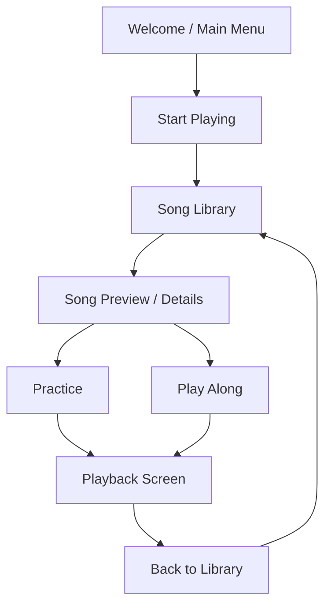

# Rexiano Session Flow Design

Date: 2026-06-25

## Summary

Rexiano should use one primary musical entry point from the welcome screen:
`Start Playing`.

After that, the user chooses a song in the library. The song preview/details
surface owns the session choice: `Practice` or `Play Along`. Both choices enter
the same playback screen and share the same notation, falling notes, transport,
keyboard, MIDI, and audio systems.

This keeps the first screen simple while still giving the user a clear choice
once the selected song has context.

## Goals

- Make the app feel like a complete product flow: welcome screen, main menu,
  song selection, session choice, playback.
- Avoid asking children to understand `Practice` vs `Play Along` before they
  have picked a song.
- Reuse Rexiano's existing `menu`, `library`, and `playback` route model.
- Keep built-in songs, imported MIDI, recents, recommendations, list view, and
  card view in one song-selection surface.
- Make the song preview/details surface the place where session intent is
  chosen.

## Non-Goals

- Do not split `Practice` and `Play Along` into separate top-level app sections.
- Do not add a separate route for each session mode.
- Do not redesign the playback engine, audio scheduler, MIDI parsing, sheet
  renderer, or falling-notes renderer.
- Do not add new learning features beyond clearer session entry.

## Chosen Flow

## Screen Responsibilities

### Welcome / Main Menu

The welcome screen is a calm home base. It should emphasize one primary musical
action:

- `Start Playing`: opens the song library.
- `Options`: opens settings.
- `Exit`: optional desktop affordance if supported by the Electron app shell.

The main menu may still show progress, recent songs, and parent-facing summary
data, but those should support the primary action rather than compete with it.

### Song Library

The song library answers: "What do I want to play now?"

It should keep:

- Search, filters, sort, favorites, recommendations, recents, imported MIDI,
  and watched folders.
- Both list and card views. List view should remain the best default for dense
  scanning; card view remains useful for a more visual browsing mode.
- Inline preview on wider screens when there is enough room.
- Modal or bottom-sheet preview on narrow screens where inline preview would
  push the list too far down.

Clicking a song should select it and open/focus its preview. It should not
immediately start a playback session.

### Song Preview / Details

The preview answers: "What is this song, and how do I want to run this
session?"

It should show:

- Title and composer.
- Duration, level, category, best score, and track count when available.
- Tags and basic metadata.
- Audio preview.
- Session CTAs: `Practice` and `Play Along`.

The preview should present `Practice` as the primary CTA when the song has
practice history or is part of a recommendation. `Play Along` should remain a
clear secondary CTA, not hidden in advanced controls.

### Playback Screen

The playback screen answers: "I am now playing this song."

It should be shared by both session types:

- Sheet/falling/split display modes.
- Transport controls.
- Piano keyboard.
- MIDI device controls.
- Settings drawer.
- Track, hand, speed, and display controls where applicable.

The mode should be visible in the playback chrome so the user can understand
whether the session is a scored practice session or a no-score play-along
session.

## Session Semantics

### Practice

`Practice` means the app is actively helping the user improve the selected
song.

Default behavior:

- Use the saved per-song practice setup when available.
- Otherwise use the app default practice mode and speed.
- Scoring, hit/miss feedback, wait-mode behavior, loop controls, track
  selection, and post-session celebration/statistics remain available.

### Play Along

`Play Along` means the app plays the selected song while the user follows
without being stopped or graded.

Default behavior:

- Enter the same playback screen.
- Use a no-wait/no-score mode.
- Do not show a required mode-selection modal.
- Do not pause for missed notes.
- Do not treat misses as practice failures.
- Keep transport, sheet/falling display, keyboard highlighting, audio, and MIDI
  input feedback active.

In the current Rexiano model, this should map to the existing no-wait practice
mode rather than creating a new engine. The user-facing label can be `Play
Along` even if the internal state reuses an existing mode.

## Navigation Rules

- `Start Playing` routes from `menu` to `library`.
- Selecting a song in the library opens/focuses the preview surface.
- `Practice` loads the selected song and enters playback with practice intent.
- `Play Along` loads the selected song and enters playback with play-along
  intent.
- `Back to Library` clears the loaded song and returns to the library, not all
  the way back to the main menu.
- A top-level back affordance from library returns to the main menu.

## Accessibility and Kid Usability

- The first screen should have one obvious primary action.
- Session CTAs should use icon plus text labels, not icon-only buttons.
- Button labels should avoid jargon. Prefer `Practice` and `Play Along` over
  internal mode names.
- The selected song title and current session mode should be visible in
  playback.
- Confirmation on exit should remain available when child-focus mode is enabled
  and playback is active.

## Testing Strategy

This is a UX flow change and should be covered with focused tests before
implementation:

- Route tests for menu → library → playback and invalid playback route fallback.
- Song library behavior tests that clicking a song selects preview instead of
  immediately loading playback.
- CTA tests that `Practice` and `Play Along` pass distinct session intents.
- Store or helper tests for mapping session intent to existing practice mode
  state.
- UI tests for the preview details surface on list/card views.
- Focus-management tests if the narrow-screen preview uses a modal or bottom
  sheet.

Manual or Playwright verification should cover the full happy path:

1. Launch app at main menu.
2. Click `Start Playing`.
3. Select a song in list view.
4. Confirm preview details appear.
5. Click `Play Along` and verify playback opens with no wait/no-score behavior.
6. Return to library.
7. Select a song and click `Practice`.
8. Verify practice behavior and post-session flow still work.

## Implementation Notes

- The current `AppRoute` shape can stay as `menu | library | playback`.
- Session intent can be carried through a small typed state or action helper
  instead of adding a route.
- `SongLibrary` already has a selected-song preview model and can evolve from
  one `Practice` CTA to two session CTAs.
- The current mode-selection modal should be removed from the default
  song-entry path or limited to cases where the user explicitly asks to change
  detailed practice settings.
- Existing per-song setup should remain the source of truth for practice
  defaults.
