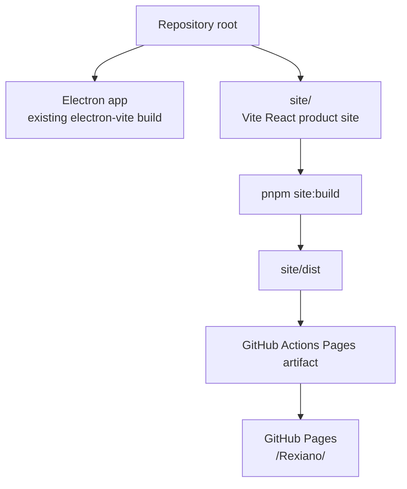

# Rexiano GitHub Pages Product Site Design

Date: 2026-06-26

## Summary

Rexiano should have a polished GitHub Pages product site that introduces the
app, routes users to downloads and guides, and gives contributors a credible
technical entry point.

The site is not a sales page. It is a product and documentation hub for an
open-source piano practice app: show what Rexiano does, prove it with real app
screenshots, then guide readers to install, practice, connect MIDI, read docs,
or contribute.

## Goals

- Publish a beautiful, low-maintenance GitHub Pages site for Rexiano.
- Make the first viewport immediately communicate: piano practice, falling
  notes, sheet music, MIDI keyboards, and open source.
- Use real Rexiano screenshots instead of fictional product mockups.
- Provide fast routes to releases, user guide, installation, MIDI setup,
  architecture docs, roadmap, and GitHub.
- Keep the implementation isolated from the Electron app build.
- Add a Pages deployment workflow that can be verified in CI and enabled from
  repository settings.

## Non-Goals

- Do not turn the site into a paid-product marketing funnel.
- Do not replace the README or full Markdown docs.
- Do not build a multi-page documentation system in this slice.
- Do not change Electron app runtime behavior.
- Do not introduce a heavy site framework when a small Vite React site is
  enough.

## Chosen Approach

Use an independent Vite React app under `site/`, deployed by GitHub Actions to
GitHub Pages.



This keeps the Pages build separate from `electron-vite`, avoids changing the
desktop app's routing or packaging, and lets the site use normal browser QA.

## Audience

| Audience                | Primary Question                          | Site Answer                                             |
| ----------------------- | ----------------------------------------- | ------------------------------------------------------- |
| Parent or learner       | "Can this help me practice piano?"        | Show the practice flow, screenshots, and guide links.   |
| MIDI keyboard owner     | "Will this work with my keyboard?"        | Surface USB/Bluetooth MIDI guidance and platform notes. |
| Open-source contributor | "Is this real and maintainable?"          | Link architecture, roadmap, tests, license, and GitHub. |
| Returning user          | "Where do I download or read the manual?" | Keep download and docs links visible in nav and footer. |

## Information Architecture

### 1. Hero

The hero is the product signal. It should show Rexiano by name, explain the app
in one sentence, and display real app screenshots.

Required copy:

- H1: `Rexiano`
- Lead: `Open-source piano practice with falling notes, sheet music, MIDI keyboards, and focused practice tools.`
- Primary CTA: `Download`
- Secondary CTA: `Read the guide`
- Tertiary CTA: `View on GitHub`

Hero media:

- Use `docs/assets/screenshots/rexiano-practice.png` as the main visual.
- Use smaller overlapping frames or a rail for `rexiano-library.png` and
  `rexiano-split-sheet.png`.
- Do not tint screenshots with a color overlay. Let the real product colors
  carry the page.

### 2. Practice Flow

Show the normal learner path in three steps:

1. Choose a song.
2. Practice with Wait mode, speed control, loops, and track setup.
3. Review progress and choose the next action.

This section can use compact horizontal steps on desktop and stacked steps on
mobile.

### 3. Feature Tour

Present the main capabilities as a guided tour, not a generic card wall:

- Falling notes and piano keyboard.
- Sheet music and split view.
- USB/Bluetooth MIDI input and output.
- Watch, Wait, and Free practice modes.
- Progress history, parent report, and daily goal.
- Offline bundled SoundFont with synthesizer fallback.

### 4. Screenshot Gallery

Use the three existing screenshots with short captions:

- Library: songs, recommendations, lesson path, import.
- Practice: falling notes, keyboard, transport, practice controls.
- Split Sheet: staff notation plus falling notes.

### 5. Getting Started

Give readers direct next steps:

- Download from GitHub Releases.
- Read installation guide.
- Connect a MIDI keyboard.
- Import a MIDI file.

Include platform notes for Windows, macOS, and Linux, but keep full details in
the installation docs.

### 6. Docs Hub

Use a compact resource grid:

- User Guide.
- Installation Guide.
- MIDI / Bluetooth setup section.
- Architecture.
- Roadmap.
- Release signing and update flow.

### 7. Open Source Footer

Close with:

- GPL-3.0 license.
- Built for Rex, shared with learners.
- Links to GitHub, Releases, Issues, and Docs.

## Visual Direction

The site should extend Rexiano's Ocean theme rather than invent a new brand.
The tone is calm, musical, and trustworthy: friendly enough for parents and
children, precise enough for developers.

### Design Tokens

| Token          | Value     | Use                                    |
| -------------- | --------- | -------------------------------------- |
| `page`         | `#f5fbf8` | Main background.                       |
| `surface`      | `#ffffff` | Raised sections and screenshot frames. |
| `surface-soft` | `#e8f5f1` | Soft bands and step backgrounds.       |
| `ink`          | `#17211f` | Primary text.                          |
| `muted`        | `#60716d` | Body and captions.                     |
| `teal`         | `#0b8f87` | Primary CTA and active accents.        |
| `coral`        | `#e65d4f` | Lesson path / human warmth accent.     |
| `gold`         | `#c69b32` | Progress / achievement accent.         |
| `border`       | `#c9ddd7` | Hairlines and screenshot frames.       |

### Typography

- Display: use the existing bundled `Nunito` variable family for the product
  name and major headings.
- Body: use `DM Sans` for readable paragraphs and navigation.
- Utility/data labels: use `JetBrains Mono` sparingly for platform tags, version
  labels, and short technical notes.
- Keep letter spacing at `0`; do not use viewport-based font scaling.

### Signature Element

Use a subtle "falling-note staff rail" as the page's memorable device:

- A thin vertical rhythm line that connects select sections.
- Small note markers or staff fragments near major transitions.
- It should reinforce the piano-practice subject, not become decorative noise.

### Layout Rules

- The first viewport must show the product name, app purpose, primary CTAs, and
  at least one real screenshot.
- The next section should peek above the fold on desktop and mobile.
- Avoid nested cards. Use full-width bands, screenshot frames, and open layouts.
- Cards are allowed for repeated docs resources and platform links only.
- Keep screenshots in stable aspect-ratio frames.
- Ensure all button text fits on mobile.

## Interactions

The site should be mostly informational, with small useful interactions:

- Sticky header that links to `Features`, `Screenshots`, `Start`, `Docs`, and
  `GitHub`.
- Smooth in-page navigation.
- Screenshot gallery with selectable tabs or buttons for Library, Practice, and
  Split Sheet.
- Platform selector in Getting Started that swaps Windows/macOS/Linux notes.
- Accessible focus states for all controls.
- Respect `prefers-reduced-motion`.

## Accessibility

- Use semantic landmarks: `header`, `main`, `section`, `footer`.
- Use one H1.
- Keep link text descriptive.
- Preserve alt text for all screenshots.
- Ensure keyboard users can operate gallery/platform selectors.
- Maintain visible focus rings and sufficient contrast.

## Responsive Behavior

| Viewport | Behavior                                                                                                                      |
| -------- | ----------------------------------------------------------------------------------------------------------------------------- |
| Desktop  | Hero uses text + large screenshot composition; sections alternate text/media.                                                 |
| Tablet   | Hero screenshot moves below copy; feature tour becomes two-column.                                                            |
| Mobile   | Single column, sticky header simplified, CTAs wrap into stacked buttons, gallery becomes vertical tabs or segmented controls. |

## Implementation Plan Shape

Add:

- `site/package.json`
- `site/index.html`
- `site/vite.config.ts`
- `site/src/App.tsx`
- `site/src/main.tsx`
- `site/src/styles.css`
- `.github/workflows/pages.yml`

Root `package.json` should add:

- `site:dev`
- `site:build`
- `site:preview`

The site should reference repo assets using stable relative paths during Vite
build. If direct imports from `docs/assets` are awkward, copy site-facing assets
into `site/public/assets/` and document that they are generated from the README
screenshot flow.

## Deployment

GitHub Actions should:

1. Checkout.
2. Set up pnpm and Node 22.
3. Install dependencies with the existing lockfile.
4. Run `pnpm site:build`.
5. Upload `site/dist` as Pages artifact.
6. Deploy to Pages on pushes to `main` and manual dispatch.

The Vite base path should be `/Rexiano/` for project Pages.

## Testing Strategy

Minimum local verification:

```bash
pnpm site:build
```

Visual verification:

- Run local preview or a static file server against `site/dist`.
- Check desktop and mobile screenshots.
- Confirm no console errors.
- Confirm nav, gallery, platform selector, and CTA links work.

If adding Playwright coverage, add a focused Pages smoke test that checks:

- Page renders nonblank.
- H1 and CTAs exist.
- Gallery/platform selectors update visible state.
- Internal documentation links have expected hrefs.

## Open Questions

- Whether the final public URL should be only GitHub Pages
  (`https://endeavoryen.github.io/Rexiano/`) or later a custom domain.
- Whether to support Traditional Chinese on the Pages site in the first slice or
  link to Chinese docs only. The first implementation should keep the page in
  English and prominently link Traditional Chinese docs unless bilingual Pages
  content is explicitly requested.
