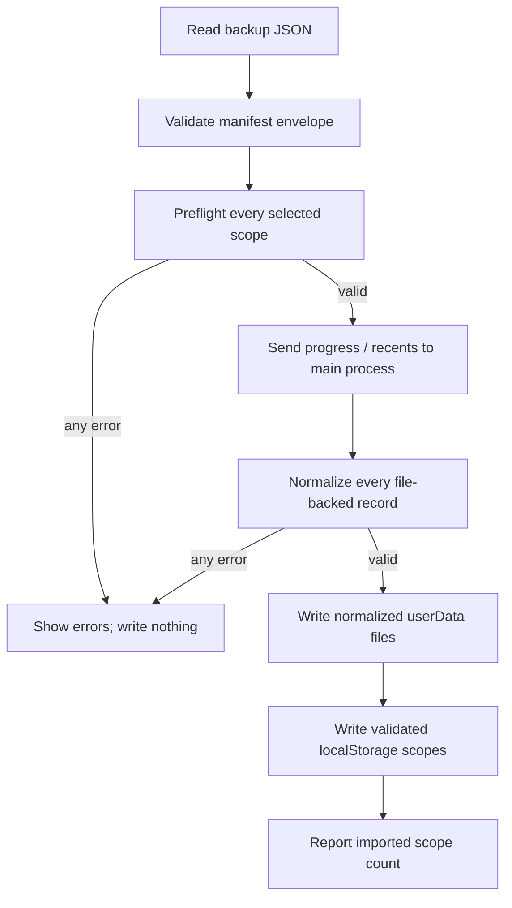

# User Data Backup Integrity Design

Date: 2026-07-10

## Summary

Rexiano's user-data backup flow must restore the same data it claims to
export, and it must reject malformed data before changing any persisted state.

The current backup inventory points `libraryMetadata` at
`rexiano-library-metadata`, while the song-library store actually persists to
`rexiano-song-library`. The main-process import path also accepts any array for
`progress` and `recents`, even when individual records do not satisfy the
existing persistence validators. Together, these gaps can produce a successful
import message while library data is omitted or invalid records disappear on
the next load.

The chosen design centralizes renderer storage keys, validates every selected
scope before mutation, and independently validates file-backed records again at
the Electron IPC boundary.

## Goals

- Export and restore the actual song-library preferences, favorites, watched
  folders, imported-song metadata, and availability state.
- Reject malformed backup scope data before writing any selected scope.
- Reject an entire `progress` or `recents` import when any record is invalid.
- Reuse the existing persistence normalization rules rather than introducing a
  second definition of valid session and recent-file records.
- Preserve compatibility with valid schema-version-1 backup manifests.
- Keep the change small, dependency-free, and covered by Red-Green-Refactor
  tests.

## Non-Goals

- Do not add backup encryption, cloud sync, compression, or automatic backup
  scheduling.
- Do not introduce a new database or persistence dependency.
- Do not implement a cross-process rollback protocol for disk or quota failures
  that occur after validation succeeds.
- Do not change the user-facing set of backup scopes or bump the backup schema
  version.
- Do not refactor the Settings panel, Song Library, or application shell beyond
  the storage-key and validation seams needed by this change.

## Current Failure Modes

### Song-library storage-key drift

`USER_DATA_BACKUP_SCOPE_INVENTORY` associates `libraryMetadata` with a storage
key that no runtime store writes. Export therefore omits the actual
`rexiano-song-library` value, and Reset All leaves that value untouched.

### File-backed records are only container-checked

`importUserDataFiles` verifies that `progress` and `recents` are arrays but does
not validate their elements. A malformed array is written successfully. Later,
the regular progress and recents loaders discard invalid records through
`normalizeSessionRecord` and `normalizeRecentFile`, making the successful import
misleading and potentially destructive.

### Manifest validation stops at the envelope

Renderer validation checks the app identifier, schema version, date, scope
names, and presence of scoped data. It does not verify that each scope contains
the expected container or record structure before the runtime apply phase.

## Chosen Architecture

### Shared renderer storage-key registry

Add a pure module at
`src/renderer/src/features/settings/userDataStorageKeys.ts`. It will export the
three backup-owned renderer keys:

```ts
export const USER_DATA_STORAGE_KEYS = {
  settings: "rexiano-settings",
  libraryMetadata: "rexiano-song-library",
  perSongSetup: "rexiano-song-practice-setup",
} as const;
```

`useSettingsStore`, `useSongLibraryStore`, `songPracticeSetup`, and
`USER_DATA_BACKUP_SCOPE_INVENTORY` will consume these constants. No backup code
will duplicate the storage-key strings.

### Renderer scope preflight

`validateUserDataBackupManifest` will validate selected scope data after the
manifest envelope is valid:

- `settings`: a plain object. Individual settings remain backward-compatible
  because `normalizePersistedSettings` already defaults missing or invalid
  optional fields when the store loads.
- `libraryMetadata`: a plain object. The song-library store already normalizes
  view mode, sort mode, string arrays, paths, and imported-song records.
- `perSongSetup`: a plain object whose values are practice-setup snapshots with
  valid active-track indices, hand assignments, practice mode, speed, timestamp,
  and optional track preferences.
- `progress`: an array. Element validation remains authoritative in the main
  process.
- `recents`: an array. Element validation remains authoritative in the main
  process.

Validation collects deterministic, scope-specific errors. If any selected
scope is invalid, the manifest result is unsuccessful and no apply call occurs.

### Main-process trust boundary

`userDataBackupHandlers.ts` will validate and normalize all selected
file-backed records before the first write:

- Every `progress` element must produce a non-null value from
  `normalizeSessionRecord`.
- Every `recents` element must produce a non-null value from
  `normalizeRecentFile`.
- Errors identify the scope and failing array index.
- Validation runs for all selected scopes first. If any record is invalid,
  `writeFile` is not called for any scope.
- Valid normalized records, rather than unchecked input, are written to disk.

The same record validation will run during backup export. If an existing file
contains invalid records, export reports the affected scope and index instead
of producing a backup that cannot round-trip faithfully.

## Data Flow



File-backed scopes are applied before localStorage scopes so a main-process
validation failure cannot leave renderer storage partially updated. This design
guarantees validation-before-mutation; it does not claim transactional rollback
for unexpected I/O failures after writes begin.

## Error Handling

- Envelope errors keep the existing messages for unsupported app identifiers,
  schema versions, dates, scopes, and missing data.
- Scope-shape errors use the form `Backup <scope> data must be <shape>.`
- File-record errors use the form
  `Cannot import <scope>: record at index <n> is invalid.`
- Export uses the equivalent `Cannot export ...` prefix.
- The Settings panel continues to display the returned error list and does not
  show a success state when validation fails.

## Compatibility

- `USER_DATA_BACKUP_SCHEMA_VERSION` remains `1`.
- Valid existing v1 backups continue to import.
- A v1 backup containing `libraryMetadata` now restores that value to the
  correct `rexiano-song-library` key.
- Legacy v0 migration still infers known scopes, then passes the migrated
  manifest through the same scope validation.
- Invalid backups that were previously accepted will now fail closed with an
  actionable error.

## Testing Strategy

### Renderer unit tests

- Prove the backup inventory uses the shared runtime storage keys.
- Prove export reads `rexiano-song-library`, not the stale key.
- Prove Reset All removes the actual song-library key.
- Prove manifest validation rejects incorrect containers for all five scopes.
- Prove malformed per-song setup snapshots are rejected.
- Preserve valid v0 migration and v1 round-trip coverage.

### Main-process unit tests

- Start with failing tests showing that invalid session and recent-file records
  are currently written.
- Prove any invalid record rejects the whole import and causes zero writes.
- Prove mixed-scope imports do not partially write when one scope fails.
- Prove valid records are normalized and written.
- Prove export rejects invalid stored records instead of emitting them.

### Verification

Run focused tests first, followed by:

```bash
pnpm lint
pnpm typecheck
pnpm test
pnpm test:e2e
```

Use Node 22 and pnpm 10 as required by the repository.

## Expected File Changes

- Create `src/renderer/src/features/settings/userDataStorageKeys.ts`.
- Create `src/renderer/src/features/settings/userDataStorageKeys.test.ts` if the
  registry needs direct contract coverage; otherwise cover it through the
  existing backup and store tests.
- Modify `src/renderer/src/features/settings/userDataBackup.ts` and its tests.
- Modify `src/renderer/src/stores/useSettingsStore.ts` and existing tests.
- Modify `src/renderer/src/stores/useSongLibraryStore.ts` and existing tests.
- Modify `src/renderer/src/features/practice/songPracticeSetup.ts` and existing
  tests.
- Modify `src/main/ipc/userDataBackupHandlers.ts` and its tests.
- Update English and Traditional Chinese backup copy only if the final behavior
  needs to name song-library data explicitly.

## Acceptance Criteria

- Exported `libraryMetadata` comes from `rexiano-song-library`.
- Reset All removes `rexiano-song-library`.
- Invalid scope containers fail before any persisted state changes.
- Invalid progress or recent-file records fail the entire import with no file
  writes.
- Invalid stored file-backed records fail export with a clear error.
- Valid schema-v1 and migrated schema-v0 backups still round-trip.
- Focused tests, lint, typecheck, the full unit suite, and Electron E2E pass.
