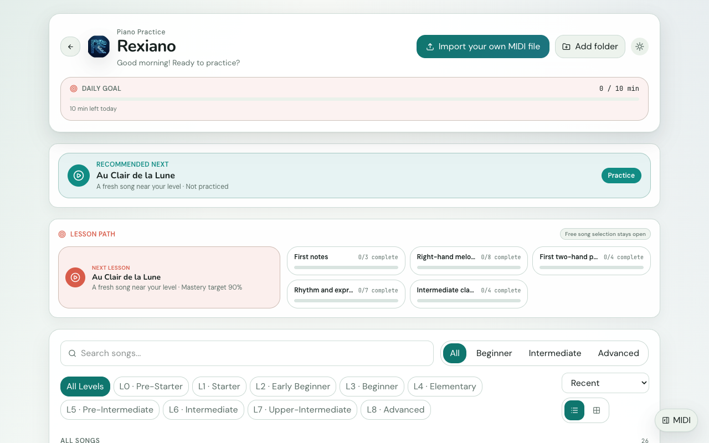
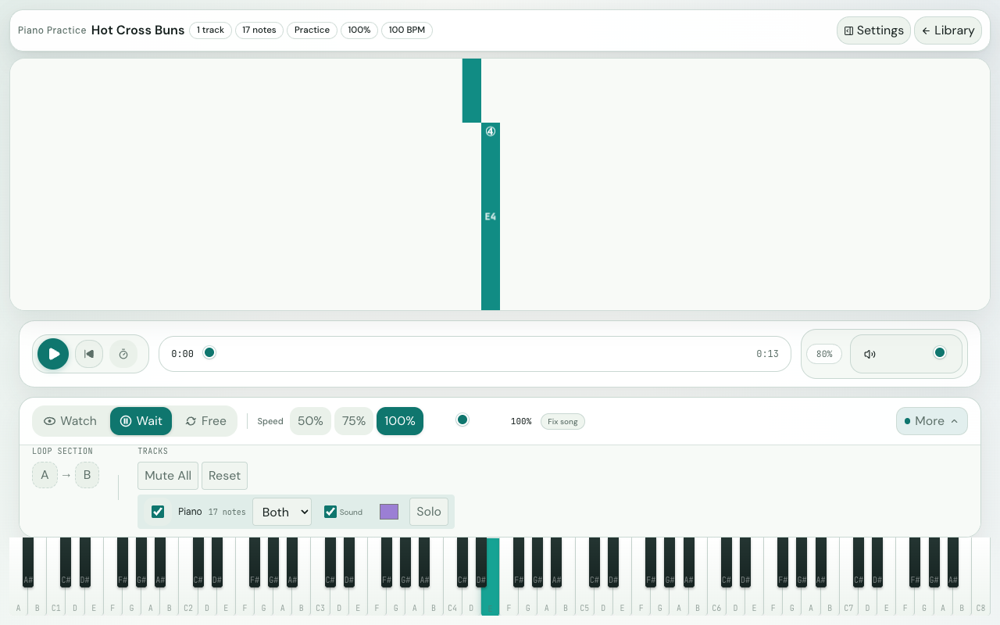
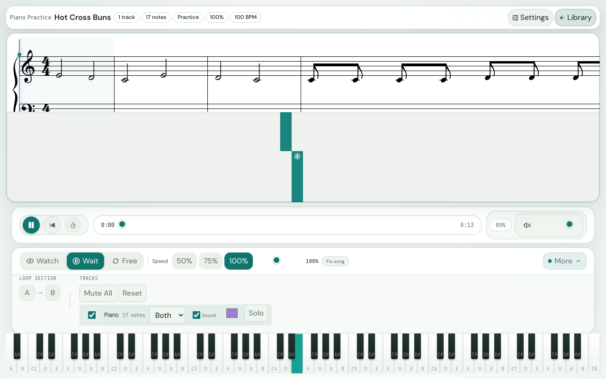

# Rexiano User Guide

> **Version**: 1.3.0 | **Last updated**: 2026-06
>
> Other languages: [繁體中文](./user-guide.md)
>
> **TL;DR** - Press **Start Playing**, choose or import a MIDI song in the library, preview it, then start **Practice** or **Play Along**. In the player, use falling notes, sheet music, Wait mode, A-B loops, MIDI keyboard feedback, and practice reports to turn each session into a small, doable task.

---

## Table of Contents

1. [Quick Start](#1-quick-start)
2. [Song Library and MIDI Import](#2-song-library-and-midi-import)
3. [Player and Display Modes](#3-player-and-display-modes)
4. [Practice Modes and A-B Loop](#4-practice-modes-and-a-b-loop)
5. [Connecting a MIDI Keyboard](#5-connecting-a-midi-keyboard)
6. [Settings, Backup, and Updates](#6-settings-backup-and-updates)
7. [Keyboard Shortcuts](#7-keyboard-shortcuts)
8. [FAQ](#8-faq)
9. [Practice Tips for Parents](#9-practice-tips-for-parents)

---

## 1. Quick Start

Rexiano's main flow is: Start Playing -> Song Library -> Song Preview -> Practice or Play Along.

1. Open Rexiano. On first launch, follow the short welcome guide or skip it.
2. On the main menu, press **Start Playing**.
3. In the library, choose a built-in song or use **Import your own MIDI file** for a `.mid` / `.midi` file.
4. In **Song preview**, check length, level, category, best score, and track count. Press **Preview** if you want to listen first.
5. Press **Practice** for a guided session; press **Play Along** to enter the player directly in free play.
6. In the player, press **Space** to play or pause. Start with **Watch**, then move to **Wait** for slow practice.

> **Screen callout**: The library header shows daily goal progress, the next recommendation, lesson path, and recent songs. Selecting a song opens the preview panel with the main action buttons.

---

## 2. Song Library and MIDI Import

The library is where you choose songs, organize your own MIDI files, and track progress.

| Area                       | What it does                                           | Best use                                        |
| -------------------------- | ------------------------------------------------------ | ----------------------------------------------- |
| Daily goal                 | Shows today's practiced minutes                        | Treat it as a gentle "sit down and play" cue    |
| Recommended next           | Suggests a song from your progress                     | Use it when you are not sure what to play       |
| Lesson path                | Groups built-in songs by level and progress            | Let children move through L0, L1, L2 gradually  |
| Recent / Continue Practice | Reopens recently used MIDI files                       | Great for new teacher-assigned files            |
| All Songs                  | Built-in library with search, filters, sort, favorites | Favorite 2-3 songs for the week                 |
| Imported MIDI              | Shows imported files and watched-folder songs          | Edit title, composer, tags, level, and category |

### Import Your Own MIDI

1. Press **Import your own MIDI file**, or drag a `.mid` / `.midi` file into the Rexiano window.
2. To manage a whole folder, press **Add folder**. Rexiano lists matching MIDI files under **Imported MIDI**.
3. After import, click the song row. It opens the preview instead of starting playback immediately.
4. If the title or level is unclear, press the pencil icon to edit metadata for search and grouping.

### What to Choose in Song Preview

| Button         | Result                                                            |
| -------------- | ----------------------------------------------------------------- |
| **Preview**    | Plays a short audio preview without entering practice             |
| **Practice**   | Loads the song, usually asking you to choose **Wait** or **Free** |
| **Play Along** | Starts directly in Free mode, best for songs you already know     |

---

## 3. Player and Display Modes

The player combines notation, falling notes, piano keys, transport controls, and practice tools in one workspace.

> **Screen callout**: When a falling note reaches the hit line above the keyboard, it is time to play. The lower controls handle playback, speed, metronome, volume, practice mode, and A-B looping.

### Three Display Modes

| Mode                | What you see                           | Best for                                      |
| ------------------- | -------------------------------------- | --------------------------------------------- |
| **Notes (Falling)** | Falling notes plus the 88-key keyboard | Beginners and rhythm-game-style play          |
| **Sheet**           | Staff notation with a synced cursor    | Reading notation and checking pitch/rhythm    |
| **Both (Split)**    | Sheet music above, falling notes below | Connecting staff reading to keyboard position |

> **Screen callout**: Both / Split mode helps move a learner's attention from "where does it land?" toward "what does the notation say?"

### Playback Controls

| Control       | Function                                                    |
| ------------- | ----------------------------------------------------------- |
| Play / Pause  | Starts or pauses the loaded song                            |
| Back to start | Resets playback to 0:00                                     |
| Seek slider   | Jumps to any part of the song                               |
| Metronome     | Toggles beat cues; count-in runs before playback if enabled |
| Volume        | Adjusts Rexiano's internal volume                           |
| Audio status  | Shows loading, recovery, errors, and retry actions          |

The player also has side panels for **Practice Insights**, **Editor**, and **MIDI**. You can ignore them at first; Insights becomes more useful after a few saved sessions.

---

## 4. Practice Modes and A-B Loop

Choosing the right mode, speed, and loop is more effective than always playing from the beginning.

| Mode      | Behavior                                       | Best for                                  |
| --------- | ---------------------------------------------- | ----------------------------------------- |
| **Watch** | Plays automatically while you watch and listen | First pass through a new song             |
| **Wait**  | Pauses at notes until you play them correctly  | Slow practice and fixing wrong notes      |
| **Free**  | Keeps playing while Rexiano tracks accuracy    | Testing rhythm and reaction once familiar |

### Recommended Practice Flow

1. Use **Watch** once to hear the song and see the hand split.
2. Switch to **Wait** and set speed to 50% or 75%.
3. Open **More** and select only the right-hand or left-hand track.
4. At a hard passage, press **A** at the start and **B** at the end to repeat that section.
5. After three steady repeats, raise speed toward 100%, clear the loop, and reconnect the passage.

### Speed, Tracks, and A-B Loop

| Control | What it does                                                           | Tip                                              |
| ------- | ---------------------------------------------------------------------- | ------------------------------------------------ |
| Speed   | Quick 50%, 75%, 100% buttons plus a 25%-200% slider                    | Start new songs at 50%, not full speed           |
| Tracks  | Chooses scored tracks and labels them right, left, both, or background | Mark accompaniment as background when needed     |
| Sound   | Per-track sound, solo, visibility, and color options                   | Solo the melody in teacher-made multi-track MIDI |
| A-B     | A sets loop start, B sets loop end; the seek bar highlights the range  | `L` clears the loop; use A/B to set points       |

At the end of a session, Rexiano shows accuracy, hits, misses, best streak, new-record status, and a suggested next action.

---

## 5. Connecting a MIDI Keyboard

You can watch and listen without a keyboard. Wait mode, play-along scoring, and real key feedback need USB or Bluetooth MIDI.

### USB Keyboard

1. Connect the keyboard with USB and turn it on.
2. Open Rexiano and go to the library or player.
3. Open the **MIDI** drawer.
4. Choose your keyboard under **In**. If you want Rexiano to send sound or test notes to the keyboard, choose it under **Out** too.
5. When the status turns green, press a few keys. The on-screen keyboard should light up.
6. If an output is selected, press **Test** to send a C4 test note.

### Bluetooth MIDI

| Platform | Suggested setup                                                                                                       |
| -------- | --------------------------------------------------------------------------------------------------------------------- |
| macOS    | Pair in system Bluetooth settings, then select the device in Rexiano; the **Bluetooth** button can also scan BLE MIDI |
| Windows  | Pair first, then press **Bluetooth**; if no MIDI input appears, use MIDIberry or KORG BLE-MIDI Driver as a bridge     |
| Linux    | Pair through BlueZ / ALSA, confirm a MIDI port appears, then select it in Rexiano                                     |

### Latency Compensation

If Bluetooth feels slightly late in Wait mode, open **Settings -> Advanced -> Practice** and adjust **Latency compensation**. USB usually stays at 0 ms; Bluetooth often feels better around 10-30 ms.

---

## 6. Settings, Backup, and Updates

Settings opens in **Basic** mode with theme and language only. Switch to **Advanced** for the full panel.

| Tab       | Controls                                                                                 |
| --------- | ---------------------------------------------------------------------------------------- |
| Theme     | Lavender, Ocean, Peach, Midnight                                                         |
| Display   | Piano key labels, falling note labels, fingering numbers, compact key labels             |
| Audio     | Volume, mute, audio compatibility mode                                                   |
| Practice  | Child Focus Mode, default mode, default speed, metronome, count-in, latency compensation |
| Shortcuts | Common playback, speed, loop, and back shortcuts                                         |
| Language  | English / 繁體中文                                                                       |
| Backup    | Export, import, or reset settings, progress, and recents                                 |
| About     | Version, update check, and matching release download                                     |

**Child Focus Mode** hides some advanced controls for children practicing alone. If playback is active and someone tries to leave the player, Rexiano asks before returning to the library.

---

## 7. Keyboard Shortcuts

Shortcuts are ignored while typing in search boxes or metadata fields.

| Shortcut                  | Action                                                |
| ------------------------- | ----------------------------------------------------- |
| `Space`                   | Play / Pause                                          |
| `R`                       | Reset to beginning                                    |
| `←` / `→`                 | Rewind / fast forward 5 seconds                       |
| `Shift + ←` / `Shift + →` | Rewind / fast forward 15 seconds                      |
| `↑` or `]`                | Speed +25%                                            |
| `↓` or `[`                | Speed -25%                                            |
| `1` / `2` / `3`           | Switch Watch / Wait / Free                            |
| `A` / `B`                 | Set A-B loop start / end                              |
| `L`                       | Clear A-B loop                                        |
| `M`                       | Mute / unmute                                         |
| `Esc`                     | Pause during playback; usually closes focused dialogs |
| `Ctrl+O` / `Cmd+O`        | Open MIDI file                                        |
| `?`                       | Show / hide shortcut help                             |

---

## 8. FAQ

### I cannot hear sound. What should I check?

1. Check Rexiano volume and system volume.
2. Make sure mute is off, or press `M`.
3. The SoundFont can take a few seconds to load the first time; wait if loading is shown.
4. If audio shows an error, use the retry action, or enable audio compatibility mode in Settings and reload the song.

### My MIDI keyboard does not appear. What should I do?

1. USB: unplug and reconnect, try another USB port, and confirm the keyboard is powered on.
2. Bluetooth: pair at the operating-system level first, then press **Bluetooth** in Rexiano.
3. Windows: if pairing works but no MIDI input appears, use MIDIberry or KORG BLE-MIDI Driver.
4. Close DAWs or recording apps that may be holding the MIDI device, then reopen Rexiano.

### I imported a file, but now Rexiano cannot find it.

Recent files remember their original path. If the file moved or was deleted, Rexiano shows a recovery prompt. Import it again from the new location, or remove the stale recent item.

### Why do some notes not show labels?

Very short notes hide text automatically to prevent label overlap. Use Sheet mode to confirm pitch, or slow the song down.

### Should I use sheet music or falling notes?

Start with Notes / Falling to learn which keys to press. Move to Both / Split once the song is familiar. Use Sheet when you are ready to practice notation-first reading.

---

## 9. Practice Tips for Parents

Rexiano works best when practice becomes short, clear, and finishable.

1. **Use 10-20 minute sessions**: build consistency before length.
2. **Start with L0 / L1**: easy songs create early wins.
3. **Listen before playing**: use Watch once, then Wait.
4. **Slow is faster**: 50% speed with correct notes beats repeated full-speed mistakes.
5. **Practice one hand at a time**: use track controls for right hand, then left hand, then both.
6. **Loop two measures**: make hard passages tiny; reconnect them after three steady repeats.
7. **Read the parent report, not one score**: 7-day and 30-day trends are better than a single session.
8. **Praise specific progress**: "That C to G passage was steadier today" helps more than generic praise.

_Rexiano is free, open-source software released under GPL-3.0. Source code: [github.com/EndeavorYen/Rexiano](https://github.com/EndeavorYen/Rexiano)._
